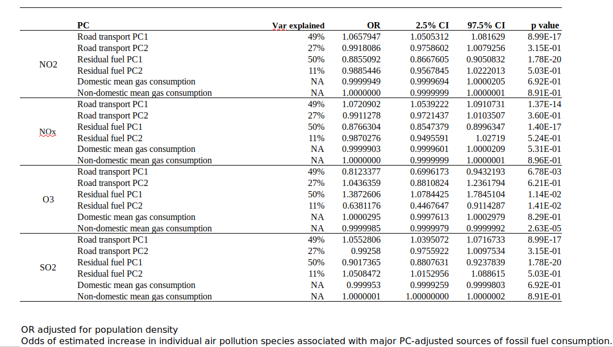

```{r setup, include=FALSE}
knitr::opts_chunk$set(echo = TRUE)
```
  
# General information

This is a data analysis pipeline linked to a manuscript deposited in medRxiv titled **Links between air pollution and COVID-19 in England** (link: https://www.medrxiv.org/content/10.1101/2020.04.16.20067405v2). This pipeline relates to data included in **Figure 3** to **Figure 6** of the manuscript as well as Supplementary tables included in the supplementary materials.

The input files for this analysis pipeline are on the master branch of this GitHub page
(link: https://github.com/M1gus/AirPollutionCOVID19)

The main aims of the workflow presented here were as follows: <br>
1. Determine a relationship between air pollutants and COVID-19-associated deaths/cases in England<br>
2. Investigate whether any relationship between air pollution and COVID-19 remains significant in the presence of counfounding factors at the regional and subregional level<br>
3. Determine the effect of air pollutants on infectivity at individual levels.
4. Determine the main contributors of air pollution at the subregional level. 

Only the UK Biobank data is not available in the repository as they require separate application. Please visit ukbiobank.ac.uk for more information. A detailed list of the variables used in the UK Biobank analysis is available here:

#### Supplementary Table 1. Variables from the UK Biobank.

```{r}
library(knitr)
kable(read.csv("data_v4/suppl_table_1.csv"))
```


<br>*These variables contained too few data and were excluded from analysis.<br>The detailed information for every variable can be retrieved by searching for the UK Biobank ID at ukbiobank.ac.uk.


## Aim 1: Preliminary analysis

Deaths/cases ~ air pollutants + population <br>
Then, Model comparisons <br> 

### Load packages

```{r packages, eval=T, echo=T, message=FALSE, warning=FALSE}
library(MASS)
library(stargazer)
library(ggplot2)
library(dplyr)
library(tidyverse)
library(purrr)
library(AER)
library(reshape)
require(rgdal) # for spTransform, requires sudo apt install libgdal-dev
require(stringr)
```

Please note: <br> the following packages may need to be installed: 
liblapack-dev<br>
liblapack3<br>
libopenblas-base<br>
libopenblas-dev<br>
texlive-fonts-recommended<br>
lmodern<br>
can be done with apt-get on ubuntu 

### View the data

Read and verify the data:
```{r Load sample data, eval=T, echo=T, message=FALSE, warning=FALSE}
preL_dt = read.csv("data_v4/26-4-2020_yyAIR_COVID_PRE_LD_dt.csv")[,-1]
head(preL_dt)
```


Quickly visualise the distribution of each variable:

```{r, message=FALSE, warning=FALSE}
require (reshape)
#normalise per column & reshape the data for plotting
preL_dt_scale = as.data.frame(sapply(preL_dt[,-c(1,4)], scale))
preL_dt_scale$Region = preL_dt$Region
preL_dt_long = melt(preL_dt_scale, in.vars = "Region")

ggplot(preL_dt_long, aes (value)) +
    geom_density() +
  geom_histogram() +
    facet_wrap(~variable) + 
  theme_bw() + 
  theme(panel.border = element_blank(), panel.grid.major = element_blank(),
panel.grid.minor = element_blank(), axis.line = element_line(colour = "black"))
```

### Models
#### Analyse the death data:

```{r}
summary(full_lm <- lm(data = preL_dt, deaths_preL ~ Average_Pop_density_personkm2 + NO.levels + NO2.levels + O3.levels))
```

The model is overdispersed - use negative binomial or poisson regressions. <br>
The poisson and Negative Binomial models work better with count data. Changing these will not affect the OLS results.
```{r}
preL_dt$NO.levels = round(preL_dt$NO.levels * 1000)
preL_dt$NO2.levels = round(preL_dt$NO2.levels * 1000)
preL_dt$O3.levels = round(preL_dt$O3.levels * 1000)
preL_dt$Average_Pop_density_personkm2 = round(preL_dt$Average_Pop_density_personkm2)
```

It is important to ensure that they are integers:

```{r}
preL_dt_int = as.data.frame(sapply(preL_dt[,2:ncol(preL_dt)], as.integer))
preL_dt_int$Region = preL_dt$Region
preL_dt_int
```


```{r}
### Number of death
summary(full_lm.nb <- glm.nb(data = preL_dt_int, deaths_preL ~ Average_Pop_density_personkm2 + NO.levels + NO2.levels + O3.levels))
summary(full_lm.p <- glm(data = preL_dt_int, deaths_preL ~ Average_Pop_density_personkm2 + NO.levels + NO2.levels + O3.levels, family = "poisson"))

#pchisq(2 * (logLik(full_lm.nb) - logLik(full_lm.p)), df = 1, lower.tail = FALSE)
#(est <- cbind(Estimate = coef(full_lm.nb), confint(full_lm.nb)))
```

#### Analyse the Cases data:

```{r}
summary(cases_lm <- lm(data = preL_dt, cases_preL ~ Average_Pop_density_personkm2 + NO.levels + NO2.levels + O3.levels))
summary(cases_lm.nb <- glm.nb(data = preL_dt_int, cases_preL ~ Average_Pop_density_personkm2 + NO.levels + NO2.levels + O3.levels))
summary(cases_lm.p <- glm(data = preL_dt_int, cases_preL ~ Average_Pop_density_personkm2 + NO.levels + NO2.levels + O3.levels, family = "poisson"))

```

##### Supplementary Table 2. Effect of air pollutants on COVID-19 cases in England at the regional level.
Cases data: table
```{r results = "asis"}
stargazer(cases_lm.p, cases_lm.nb,type="html",
          dep.var.labels="Number of cases until 8 April 2020",
          ci=TRUE, ci.level=0.95, single.row=TRUE)
```
\*: p<0.1; \*\*: p<0.05; \*\*\*: p<0.01 <br>
Each column of the table corresponds to a different type of regression model as indicated at the top. The raw estimate values of each model are listed with their 95% confidence intervals in parentheses. The p-values are indicated using the number of asterisks beside the estimates. OLS, ordinary least square; Average_Pop_densitykm2, average population density per square kilometer; NO.levels, nitrogen oxide levels; NO2.levels, nitrogen dioxide levels; O3.levels, ozone levels; Akaike Inf. Crit., Akaike’s Information Criteria; Residual Std. Error, Residual standard error.


##### Supplementary Table 3. Effect of air pollutants on COVID-19 deaths in England at the regional level.
```{r results = "asis"}
stargazer(full_lm.p, full_lm.nb,type="html",
          dep.var.labels="Number of deaths until 8 April 2020",
          ci=TRUE, ci.level=0.95, single.row=TRUE)
```
\*: p<0.1; \*\*: p<0.05; \*\*\*: p<0.01 <br>Each column of the table corresponds to a different type of regression model as indicated at the top. The raw estimate values of each model are listed with their 95% confidence intervals in parentheses. The p-values are indicated using the number of asterisks beside the estimates. OLS, ordinary least square; Average_Pop_densitykm2, average population density per square kilometer; NO.levels, nitrogen oxide levels; NO2.levels, nitrogen dioxide levels; O3.levels, ozone levels; Akaike Inf. Crit., Akaike’s Information Criteria; Residual Std. Error, Residual standard error.


## Aim 2: subregional level analysis

Aim: Analyse the effect of air pollutants on COVID cases and deaths at the regional level 

### Deaths data

#### Data curation 

```{r}
pop_dens = read.csv("data_v4/2018_official_popDensity.csv")[c("Code","X2018.people.per.sq..km")]
earnings =read.csv("data_v4/ann_earning_2018_perLA.csv")[c("Code","Mean_ann_earnings")]
age = read.csv("data_v4/processed_median_age_of_population_perLA.csv")[c("Code","median_age_2018","Name")]
covid_deaths = read.csv("data_v4/covid_deaths_until10April_byAreaCode.csv")

covid_deaths$total_deaths = covid_deaths$Home + covid_deaths$Hospital + covid_deaths$Care.home + covid_deaths$Hospice + covid_deaths$Other.communal.establishment + covid_deaths$Elsewhere

covid_deaths = covid_deaths[c("Area.code","total_deaths")]
colnames(covid_deaths) <- c("Code","deaths")

nrow(pop_dens)
nrow(earnings)
nrow(age)
nrow(covid_deaths)

#merge data
merged_covid_dt_LA = merge(covid_deaths, pop_dens, by = "Code")
merged_covid_dt_LA = merge(merged_covid_dt_LA, earnings, by = "Code")
merged_covid_dt_LA = merge(merged_covid_dt_LA, age, by = "Code")
nrow(merged_covid_dt_LA)

```

**Now, we will use a python script (in the form of a Jupyter Notebook) to match air pollution data to local authorities.**
<br>
#### Analysis 
<br>
##### Data visualisation for model selection
<br>
Load data and set correct formats 
```{r, message=FALSE, warning=FALSE}
# load data 
colnames(merged_covid_dt_LA)
merged_covid_dt_LA$X2018.people.per.sq..km = as.numeric(gsub(",","",merged_covid_dt_LA$X2018.people.per.sq..km))
merged_covid_dt_LA$Mean_ann_earnings = as.numeric(gsub(",","",merged_covid_dt_LA$Mean_ann_earnings))

write.csv(merged_covid_dt_LA, "data_output_v4/merged_covid_cov_dt_LA.csv")
```

re-read here
```{r}
covid_air_dt = read.csv("data_output_v4/merged_covidAir_cov_dt_LA.csv")
covid_air_dt$X2018.people.per.sq..km = as.numeric(covid_air_dt$X2018.people.per.sq..km)
covid_air_dt$Mean_ann_earnings = as.numeric(covid_air_dt$Mean_ann_earnings)
covid_air_dt = subset(covid_air_dt, )
```

Make sure that only England data is included
```{r}
covid_air_dt = covid_air_dt[startsWith(as.character(covid_air_dt$Code), 'E'),]
nrow(covid_air_dt)
```

Visualise all numeric data
```{r, warning=FALSE}
covid_air_dt_vis = subset(covid_air_dt, select=c(deaths, X2018.people.per.sq..km, Mean_ann_earnings,median_age_2018,pm25_val,no2_val,o3_val,
                                                 pm10_val,so2_val, nox_val))
covid_air_dt_vis = as.data.frame(sapply(covid_air_dt_vis, function(x) as.numeric(x) ) )
#normalise per column & reshape the data for plotting
covid_air_dt_vis = as.data.frame(sapply(covid_air_dt_vis, scale))

covid_air_dt_vis$Code = covid_air_dt$Code
covid_air_dt_vis_long = melt(covid_air_dt_vis, in.vars = "Code")

ggplot(covid_air_dt_vis_long, aes (value)) +
  geom_histogram() +
  geom_density() +
  facet_wrap(~variable) + 
  theme_bw() + 
  theme(panel.border = element_blank(), panel.grid.major = element_blank(),
panel.grid.minor = element_blank(), axis.line = element_line(colour = "black"))
```


##### Models

Negative binomial regression model
```{r}
summary(pm25_deaths.nb <- glm.nb(data = covid_air_dt, deaths ~ X2018.people.per.sq..km + 
                                   Mean_ann_earnings + median_age_2018 + pm25_val))
car::vif(pm25_deaths.nb)
summary(pm10_deaths.nb <- glm.nb(data = covid_air_dt, deaths ~ X2018.people.per.sq..km + 
                                   Mean_ann_earnings + median_age_2018 + pm10_val))
car::vif(pm10_deaths.nb)
summary(nox_deaths.nb <- glm.nb(data = covid_air_dt, deaths ~ X2018.people.per.sq..km + 
                                  Mean_ann_earnings + median_age_2018 + nox_val))
car::vif(nox_deaths.nb)
summary(no2_deaths.nb <- glm.nb(data = covid_air_dt, deaths ~ X2018.people.per.sq..km + 
                                  Mean_ann_earnings + median_age_2018 + no2_val))
car::vif(no2_deaths.nb)
summary(o3_deaths.nb <- glm.nb(data = covid_air_dt, deaths ~ X2018.people.per.sq..km + 
                                 Mean_ann_earnings + median_age_2018 + o3_val))
car::vif(o3_deaths.nb)
summary(so2_deaths.nb <- glm.nb(data = covid_air_dt, deaths ~ X2018.people.per.sq..km + 
                                  Mean_ann_earnings + median_age_2018 + so2_val))
car::vif(so2_deaths.nb)
```

We note that annual earnings in our models is not significant. We therefore proceed to remove this variable.

```{r}
# glm -earnings, since not significant 
summary(pm25_deaths.nb_red <- glm.nb(data = covid_air_dt, deaths ~ X2018.people.per.sq..km + 
                                    median_age_2018 + pm25_val))
car::vif(pm25_deaths.nb_red)
summary(pm10_deaths.nb_red <- glm.nb(data = covid_air_dt, deaths ~ X2018.people.per.sq..km + 
                                    median_age_2018 + pm10_val))
car::vif(pm10_deaths.nb_red)
summary(nox_deaths.nb_red <- glm.nb(data = covid_air_dt, deaths ~ X2018.people.per.sq..km + 
                                   median_age_2018 + nox_val))
car::vif(nox_deaths.nb_red)
summary(no2_deaths.nb_red <- glm.nb(data = covid_air_dt, deaths ~ X2018.people.per.sq..km + 
                                   median_age_2018 + no2_val))
car::vif(no2_deaths.nb_red)
summary(o3_deaths.nb_red <- glm.nb(data = covid_air_dt, deaths ~ X2018.people.per.sq..km + 
                                  median_age_2018 + o3_val))
car::vif(o3_deaths.nb_red)
summary(so2_deaths.nb_red <- glm.nb(data = covid_air_dt, deaths ~ X2018.people.per.sq..km + 
                                   median_age_2018 + so2_val))
car::vif(so2_deaths.nb_red)
```

<br>

##### Calculate odds ratios

```{r, message=FALSE, warning=FALSE}
pm25_deaths.nb_mrr = data.frame(cbind(exp(cbind(OR = coef(pm25_deaths.nb), confint(pm25_deaths.nb))), p_value = summary(pm25_deaths.nb)$coefficients[,4]))
pm10_deaths.nb_mrr = data.frame(cbind(exp(cbind(OR = coef(pm10_deaths.nb), confint(pm10_deaths.nb))), p_value = summary(pm10_deaths.nb)$coefficients[,4]))
nox_deaths.nb_mrr = data.frame(cbind(exp(cbind(OR = coef(nox_deaths.nb), confint(nox_deaths.nb))), p_value = summary(nox_deaths.nb)$coefficients[,4]))
no2_deaths.nb_mrr = data.frame(cbind(exp(cbind(OR = coef(no2_deaths.nb), confint(no2_deaths.nb))), p_value = summary(no2_deaths.nb)$coefficients[,4]))
o3_deaths.nb_mrr = data.frame(cbind(exp(cbind(OR = coef(o3_deaths.nb), confint(o3_deaths.nb))), p_value = summary(o3_deaths.nb)$coefficients[,4]))
so2_deaths.nb_mrr = data.frame(cbind(exp(cbind(OR = coef(so2_deaths.nb), confint(so2_deaths.nb))), p_value = summary(so2_deaths.nb)$coefficients[,4]))
#make a df just with the pollutants 

LA_covid_onlyPoll = data.frame(rbind(pm25_deaths.nb_mrr[nrow(pm25_deaths.nb_mrr),],
                                      pm10_deaths.nb_mrr[nrow(pm10_deaths.nb_mrr),],
                                      nox_deaths.nb_mrr[nrow(nox_deaths.nb_mrr),],
                                      no2_deaths.nb_mrr[nrow(no2_deaths.nb_mrr),],
                                      o3_deaths.nb_mrr[nrow(o3_deaths.nb_mrr),],
                                      so2_deaths.nb_mrr[nrow(so2_deaths.nb_mrr),]))
```

##### Plot odds ratios

sort data 
```{r}
LA_covid_onlyPoll$names = row.names(LA_covid_onlyPoll)
LA_covid_onlyPoll$significance = "p-value > 0.05"
LA_covid_onlyPoll$significance[LA_covid_onlyPoll$p_value < 0.05] <- "p-value < 0.05"
```

plot 
```{r}
ggplot(LA_covid_onlyPoll, aes(x=reorder(names, OR), y=OR, color=significance)) + 
    geom_point(fill="white", shape=21, size = 2) +
    geom_errorbar(aes(ymin=X2.5.., ymax=X97.5..),
                  width=.2,                    # Width of the error bars
                  position=position_dodge(.9)) +
  theme_bw() + 
  geom_hline(yintercept = 1, linetype="dotted") +
  coord_flip()+ylab("Mortality rate ratios") + 
  xlab("Pollutants")+
  ylim(0.75, 1.6)
ggsave('fig_out_v4/LA_deaths_MRR.pdf')
```

### Cases in local authorities

#### Data curation 

```{r warning=FALSE}
cases_LA_raw = read.csv("data_v4/coronavirus-cases_latest-18_5_2020.csv")
cases_LA_dt = subset(cases_LA_raw, Specimen.date == "2020-04-10", select = c(Area.code, Cumulative.lab.confirmed.cases))
cases_LA_dt.agg <-aggregate(cases_LA_dt, by=list(cases_LA_dt$Area.code), 
  FUN=mean, na.rm=TRUE)
nrow(cases_LA_dt.agg)
```

Merge cases data to main data 
```{r}
deaths_LA_dt = read.csv("data_output_v4/merged_covidAir_cov_dt_LA.csv")
cases_deaths_LA_dt = merge(deaths_LA_dt, cases_LA_dt.agg, by.x = "Code",by.y = "Group.1")
nrow(cases_deaths_LA_dt)
```

There are only 301 observations matched. 

#### Analysis of the cases data
Visualisation 
```{r, warning=FALSE}
ggplot(data = cases_deaths_LA_dt, aes(x = Cumulative.lab.confirmed.cases))+
  geom_histogram(stat="count")

cases_deaths_LA_dt$X2018.people.per.sq..km = as.numeric(cases_deaths_LA_dt$X2018.people.per.sq..km)
cases_deaths_LA_dt$Mean_ann_earnings = as.numeric(cases_deaths_LA_dt$Mean_ann_earnings)
```

Model
```{r}
summary(pm25_cases.nb <- glm.nb(data = cases_deaths_LA_dt, Cumulative.lab.confirmed.cases ~ X2018.people.per.sq..km + 
                                   Mean_ann_earnings + median_age_2018 + pm25_val))
car::vif(pm25_cases.nb)
summary(pm10_cases.nb <- glm.nb(data = cases_deaths_LA_dt, Cumulative.lab.confirmed.cases ~ X2018.people.per.sq..km + 
                                   Mean_ann_earnings + median_age_2018 + pm10_val))
car::vif(pm10_cases.nb)
summary(nox_cases.nb <- glm.nb(data = cases_deaths_LA_dt, Cumulative.lab.confirmed.cases ~ X2018.people.per.sq..km + 
                                  Mean_ann_earnings + median_age_2018 + nox_val))
car::vif(nox_cases.nb)
summary(no2_cases.nb <- glm.nb(data = cases_deaths_LA_dt, Cumulative.lab.confirmed.cases ~ X2018.people.per.sq..km + 
                                  Mean_ann_earnings + median_age_2018 + no2_val))
car::vif(no2_cases.nb)
summary(o3_cases.nb <- glm.nb(data = cases_deaths_LA_dt, Cumulative.lab.confirmed.cases ~ X2018.people.per.sq..km + 
                                 Mean_ann_earnings + median_age_2018 + o3_val))
car::vif(o3_cases.nb)
summary(so2_cases.nb <- glm.nb(data = cases_deaths_LA_dt, Cumulative.lab.confirmed.cases ~ X2018.people.per.sq..km + 
                                  Mean_ann_earnings + median_age_2018 + so2_val))
car::vif(so2_cases.nb)
```

#### Generate the table 
```{r results = "asis"}
stargazer(pm25_cases.nb, pm10_cases.nb, nox_cases.nb, no2_cases.nb,
          o3_cases.nb, so2_cases.nb,type="html",out = "fig_out_v4/LA_covid_allPoll_CASES_nb.html",
          dep.var.labels="Number of COVID-19-related cases",
          single.row=TRUE)
```

##### Calculate odds ratios

```{r, message=FALSE, warning=FALSE}
pm25_cases.nb_mrr = data.frame(cbind(exp(cbind(OR = coef(pm25_cases.nb), confint(pm25_cases.nb))), p_value = summary(pm25_cases.nb)$coefficients[,4]))
pm10_cases.nb_mrr = data.frame(cbind(exp(cbind(OR = coef(pm10_cases.nb), confint(pm10_cases.nb))), p_value = summary(pm10_cases.nb)$coefficients[,4]))
nox_cases.nb_mrr = data.frame(cbind(exp(cbind(OR = coef(nox_cases.nb), confint(nox_cases.nb))), p_value = summary(nox_cases.nb)$coefficients[,4]))
no2_cases.nb_mrr = data.frame(cbind(exp(cbind(OR = coef(no2_cases.nb), confint(no2_cases.nb))), p_value = summary(no2_cases.nb)$coefficients[,4]))
o3_cases.nb_mrr = data.frame(cbind(exp(cbind(OR = coef(o3_cases.nb), confint(o3_cases.nb))), p_value = summary(o3_cases.nb)$coefficients[,4]))
so2_cases.nb_mrr = data.frame(cbind(exp(cbind(OR = coef(so2_cases.nb), confint(so2_cases.nb))), p_value = summary(so2_cases.nb)$coefficients[,4]))
#make a df just with the pollutants 

LA_covid_CASES_onlyPoll = data.frame(rbind(pm25_cases.nb_mrr[nrow(pm25_cases.nb_mrr),],
                                      pm10_cases.nb_mrr[nrow(pm10_cases.nb_mrr),],
                                      nox_cases.nb_mrr[nrow(nox_cases.nb_mrr),],
                                      no2_cases.nb_mrr[nrow(no2_cases.nb_mrr),],
                                      o3_cases.nb_mrr[nrow(o3_cases.nb_mrr),],
                                      so2_cases.nb_mrr[nrow(so2_cases.nb_mrr),]))
```

##### Plot odds ratios

sort data 
```{r}
LA_covid_CASES_onlyPoll$names = row.names(LA_covid_CASES_onlyPoll)
LA_covid_CASES_onlyPoll$significance = "p-value > 0.05"
LA_covid_CASES_onlyPoll$significance[LA_covid_CASES_onlyPoll$p_value < 0.05] <- "p-value < 0.05"
```

plot 
```{r, message=FALSE, warning=FALSE}
ggplot(LA_covid_CASES_onlyPoll, aes(x=reorder(names, OR), y=OR, color=significance)) + 
    geom_point(fill="white", shape=21, size = 2) +
    geom_errorbar(aes(ymin=X2.5.., ymax=X97.5..),
                  width=.2,                    # Width of the error bars
                  position=position_dodge(.9)) +
  theme_bw() + 
  geom_hline(yintercept = 1, linetype="dotted") +
  coord_flip()+ylab("Infectivity rate ratios") + 
  xlab("Pollutants")+
  ylim(0.75, 1.6)
ggsave('fig_out_v4/LA_CASES_odds_IRR.pdf')
```


### Summary tables of models in Aim 2

#### Supplementary Table 4. Effect of air pollutants on the number of COVID-related cases at the subregional level

```{r results = "asis"}
stargazer(pm25_cases.nb, pm10_cases.nb, nox_cases.nb, no2_cases.nb,
          o3_cases.nb, so2_cases.nb,type="html",out = "fig_out_v4/LA_covid_allPoll_CASES_nb.html",
          dep.var.labels="Number of COVID-19-related cases",
          single.row=TRUE)
```
\*: p<0.1; \*\*: p<0.05; \*\*\*: p<0.01 <br> 
The value in parentheses represent the standard error. <br>
Summary of the effects of individual air pollutant species on lab-confirmed COVID-related cases up to April 10th 2020. The three asterisks near the theta indicate that the models are significantly better than null.

#### Supplementary Table 5. Effect of air pollutants on the number of COVID-related deaths at the subregional level

```{r results = "asis"}
stargazer(pm25_deaths.nb, pm10_deaths.nb, nox_deaths.nb, no2_deaths.nb,
          o3_deaths.nb, so2_deaths.nb,type="html",out = "fig_out_v4/LA_covid_allPoll_nb.html",
          dep.var.labels="Number of COVID-19-related deaths",
          single.row=TRUE)
```
\*: p<0.1; \*\*: p<0.05; \*\*\*: p<0.01 <br> Summary of the effects of individual air pollutant species on lab-confirmed COVID-related deaths up to April 10th 2020. The three asterisks near the theta indicate that the models are significantly better than null. The MRR (mortality rate ratios) of O3 is interesting: more O3 = ~3% less deaths. NOx, NO2 and SO2 are all significant predictors; they will increase the number of deaths by 1.3, 2.4 and 17.2% respectively, per 1 µg/m3.

## Aim 3: Indiviudal level analysis

### Data curation 


#### covid data curation 
```{r, warning=FALSE, message=FALSE}
covid_df = read.csv("data_v4/covid19_result.txt", sep = '\t')
covid_id = covid_df[,c(1,5,6)]
# I didnt realise that there were repeated values!!!!!
colnames(covid_id)

covid_id_unique = aggregate(covid_id, by=list(covid_id$eid), 
                            FUN=max)

ggplot(data = covid_id_unique, aes(x = result))+
  geom_histogram(stat="count")
ggplot(data = covid_id_unique, aes(x = origin))+
  geom_histogram(stat="count")
```

#### load non-covid UKB phenotype data

Data curation 
```{r}
### load non-covid UKB phenotype data ----
ukb_covid = read.csv("data_v4/29_4_2020_ukb41646_covid19_subset.csv")[,-1]
#check distribution

#here, I will aggregate the columns by selecting the last results, for each 
# reshape
ukb_covid_t = melt(ukb_covid, id='eid')
ukb_covid_t <- ukb_covid_t[order(ukb_covid_t$variable),] 
#delete everything after period 
ukb_covid_t$variable = gsub("\\..*","",ukb_covid_t$variable)

#aggregate by last 
ukb_covid_t_na = na.omit(ukb_covid_t)
ukb_covid_t_na = aggregate(ukb_covid_t_na, by=list(ukb_covid_t_na$eid,ukb_covid_t_na$variable), FUN=last)

# put it back straight 
ukb_covid_t_na$variable = as.factor(ukb_covid_t_na$variable)
ukb_covid_t_na = ukb_covid_t_na[,-c(1,2)]
ukb_covid_cur = cast(ukb_covid_t_na, eid~variable)

### label UKB data ----
#get levels and labels 
lvl.0493 <- c(-141,-131,-121,0)
lbl.0493 <- c("Often","Sometimes","Do not know","Rarely/never")

lvl.0007 <- c(0,1)
lbl.0007 <- c("No","Yes")

lvl.100349 <- c(-3,-1,0,1)
lbl.100349 <- c("Prefer not to answer","Do not know","No","Yes")

lvl.0090 <- c(-3,0,1,2)
lbl.0090 <- c("Prefer not to answer","Never","Previous","Current")

lvl.0009 <- c(0,1)
lbl.0009 <- c("Female","Male")

### eid replacement, saved here ----
yy_replace <- function(string, patterns, replacements) {
  for (i in seq_along(patterns))
    string <- gsub(patterns[i], replacements[i], string, perl=TRUE)
  string
}
#label = replacement, lvl = to replace

ukb_covid_cur$X22609 <- yy_replace(ukb_covid_cur$X22609, lvl.0493, lbl.0493)
ukb_covid_cur$X22610 <- yy_replace(ukb_covid_cur$X22610, lvl.0493, lbl.0493)
ukb_covid_cur$X22611 <- yy_replace(ukb_covid_cur$X22611, lvl.0493, lbl.0493)
ukb_covid_cur$X22615 <- yy_replace(ukb_covid_cur$X22615, lvl.0493, lbl.0493)
ukb_covid_cur$X22616 <- yy_replace(ukb_covid_cur$X22616, lvl.0007, lbl.0007)
ukb_covid_cur$X2316 <- yy_replace(ukb_covid_cur$X2316, lvl.100349, lbl.100349)
ukb_covid_cur$X31 <- yy_replace(ukb_covid_cur$X31, lvl.0009, lbl.0009)
ukb_covid_cur$X22130 <- yy_replace(ukb_covid_cur$X22130, lvl.0007, lbl.0007)
ukb_covid_cur$X2443 <- yy_replace(ukb_covid_cur$X2443, lvl.100349, lbl.100349)
ukb_covid_cur$X20116 <- yy_replace(ukb_covid_cur$X20116, lvl.0090, lbl.0090)


### put custom column names----
#get the ID that I designed
UID_names = read.csv("data_v4/UKB_list_columns_AIRcovid.csv")[c("FieldID","my_colname")]
UID_names$FieldID = paste("X",UID_names$FieldID, sep = "")
UID_names$my_colname = lapply(UID_names$my_colname,toString)
UID_names[nrow(UID_names) + 1,] = c("eid","eid")

# sort it according to the dataset

UID_names_match = colnames(ukb_covid_cur)

UID_sort_df = data.frame(UID_names_match)
colnames(UID_sort_df) <- "FieldID"

#merge to sort
UID_sort_df = merge(UID_sort_df, UID_names, by = "FieldID")
# this is now sorted according to the correct df

#replace column names
ukb_covid_df = ukb_covid_cur

colnames(ukb_covid_df) <- UID_sort_df$my_colname

### merge both ukb datasets together ----
ukb_covid_merge = merge(covid_id_unique[,-1], ukb_covid_df, by = "eid")
nrow(ukb_covid_merge)
```

further processing... 
```{r}
# do 2020 since COVID occurred in this year
ukb_covid_merge$age = 2020 - ukb_covid_merge$birthYear
ukb_covid_merge$whr = ukb_covid_merge$waist / ukb_covid_merge$hip

#definition from the NHS: Diastolic >= 90 OR Systolic >=140
ukb_covid_merge$highBP[ukb_covid_merge$diaBP>=90 | ukb_covid_merge$sysBP>=140] <-1
ukb_covid_merge$highBP[ukb_covid_merge$diaBP<90 | ukb_covid_merge$sysBP<140] <-0

# add a column: COVID + and inpatient
ukb_covid_merge$inpatient_covid  <-0
ukb_covid_merge$inpatient_covid [ukb_covid_merge$origin == 1 & ukb_covid_merge$origin == 1] <-1

write.csv(ukb_covid_merge, "data_output_v4/processed_29_4_2020_ukb41646_covid19.csv")
```

#### Preliminary analysis with PM2.5

I will load the air pollutants & match the covid patients to their nearest pollution climate mapping location.
```{r}
### load pm2.5 data ----
#note the pop weighted data have the area code, but not the x y coords

pm25 = read.csv("data_v4/processed_PM25_uk-air_annual_mean_mappm252018g.csv", na.strings = "MISSING")[c("x","y","pm252018g")]
nrow(pm25)
pm25_na = na.omit(pm25)
nrow(pm25_na)
### convert to lon lat - pm2.5 ----

# transform: easting/northing -> long/lat
### shortcuts (from https://stephendavidgregory.github.io/useful/UKgrid_to_LatLon)
ukgrid <- "+init=epsg:27700"
latlong <- "+init=epsg:4326"

### Create coordinates variable
pm25_coords <- cbind(Easting = as.numeric(as.character(pm25_na$x)),
                Northing = as.numeric(as.character(pm25_na$y)))

### Create the SpatialPointsDataFrame
pm25_SP <- SpatialPointsDataFrame(pm25_coords,
                                 data = pm25_na,
                                 proj4string = CRS("+init=epsg:27700"))

### Convert
pm25_LL <- spTransform(pm25_SP, CRS(latlong))

pm25_ll_df = data.frame('pm25_lon' = coordinates(pm25_LL)[, 1], 'pm25_lat' = coordinates(pm25_LL)[, 2], 'pm25_val' = pm25_LL$pm252018g)


write.csv(pm25_ll_df,"data_output_v4/processed_pm25_lonlat.csv")
```

#### convert UKB data to long lat 
```{r, message=FALSE}
# convert ukb data eastings northing to lon lat 

ukb_covid_coord_na = na.omit(ukb_covid_merge[c("eid","x_coord","y_coord")])
nrow(ukb_covid_coord_na)
ukb_covid_coords <- cbind(Easting = as.numeric(as.character(ukb_covid_coord_na$x_coord)),
                     Northing = as.numeric(as.character(ukb_covid_coord_na$y_coord)))
### Create the SpatialPointsDataFrame
ukb_covid_SP <- SpatialPointsDataFrame(ukb_covid_coords,
                                  data = ukb_covid_coord_na,
                                  proj4string = CRS("+init=epsg:27700"))

### Convert
ukb_covid_ll <- spTransform(ukb_covid_SP, CRS(latlong))

ukb_covid_ll_df = data.frame('ukb_lon' = coordinates(ukb_covid_ll)[, 1], 
                             'ukb_lat' = coordinates(ukb_covid_ll)[, 2], 
                             'eid' = ukb_covid_ll$eid)
write.csv(ukb_covid_ll_df, ("data_output_v4/ukb_covid_lonlat_df.csv"))
# plot UKB locations
library("sf")
library("rnaturalearth")
library("rnaturalearthdata")
library(rgeos)
world <- ne_countries(scale = "medium", returnclass = "sf")
ggplot(data = world) +
  geom_sf() +
  geom_point(data = ukb_covid_ll_df, aes(x = ukb_lon, y = ukb_lat), size = 1, 
             shape = 23, fill = "darkred") +
  coord_sf(ylim = c(min(ukb_covid_ll_df$ukb_lat)-2, max(ukb_covid_ll_df$ukb_lat)+4), 
           xlim = c(min(ukb_covid_ll_df$ukb_lon)-4, max(ukb_covid_ll_df$ukb_lon)+3), expand = FALSE)
ggsave('fig_out_v4/UKB_COVID_participants_locations.pdf')
```


**I wrote a python script: match_air_to_UKB_covid**

### Merge and QC data for PM2.5 
```{r}

ukb_eid_pm25_merged = read.csv('data_output_v4/merged_ukb_pm25.csv')[c("eid","distance","pm25_val")]

ukb_covid_pm25_df = merge(ukb_covid_merge, ukb_eid_pm25_merged, by = 'eid')
colnames(ukb_covid_pm25_df)
#omit those without coordinates in the ukb data 

### merge pop density----
ukb_cities_eid = read.csv("data_output_v4/2_5_2020_ukb_eid_match_cities.csv")[c("eid","spec_area","gen_area")]
nrow(ukb_cities_eid)
popDens_2018 = read.csv("data_v4/2018_official_popDensity.csv")[c("Name","X2018.people.per.sq..km")]
popDens_2018$X2018.people.per.sq..km = gsub(",", "", popDens_2018$X2018.people.per.sq..km)
popDens_2018$X2018.people.per.sq..km = as.numeric(popDens_2018$X2018.people.per.sq..km)

#Make everything lower case
ukb_cities_eid$spec_area = tolower(ukb_cities_eid$spec_area)
ukb_cities_eid$gen_area = tolower(ukb_cities_eid$gen_area)
popDens_2018$Name = tolower(popDens_2018$Name)

#delete repeated strings
ukb_cities_eid$spec_area = gsub("london borough of ", "", ukb_cities_eid$spec_area)
ukb_cities_eid$spec_area = gsub("royal borough of ", "", ukb_cities_eid$spec_area)
ukb_cities_eid$spec_area = gsub("city of ", "", ukb_cities_eid$spec_area)
ukb_cities_eid$spec_area = gsub("st helens", "helens", ukb_cities_eid$spec_area)
ukb_cities_eid$gen_area = gsub(" combined authority", "", ukb_cities_eid$gen_area)
popDens_2018$Name = gsub(", city of", "", popDens_2018$Name)
popDens_2018$Name = gsub("st. ", "", popDens_2018$Name)
#delete west midlands because its redundant (all cities are well defined) and there are several regions called west midlands so it's confusing
popDens_2018$Name = gsub("west midlands", "deleted_west_midlands_because_redundant", popDens_2018$Name)
popDens_2018$Name = gsub("\\s*\\([^\\)]+\\)","",popDens_2018$Name)

ukb_cities_eid_merged = merge(ukb_cities_eid, popDens_2018, by.x="spec_area",by.y="Name", all.x=TRUE)
colnames(ukb_cities_eid_merged)[4] <- "spec_Pop_dens_perkm2"
nrow(ukb_cities_eid_merged)

#check for duplicated rows in popDens
length(unique(popDens_2018$Name))
length(popDens_2018$Name) # there is a dupicate
popDens_2018$Name[duplicated(popDens_2018$Name)]

ukb_cities_eid_merged2 = merge(ukb_cities_eid_merged, popDens_2018, by.x="gen_area",by.y="Name", all.x=TRUE,all.y=FALSE)
colnames(ukb_cities_eid_merged2)[5] <- "gen_Pop_dens_perkm2"
nrow(ukb_cities_eid_merged2)

#QC
sum(is.na(ukb_cities_eid_merged2$spec_Pop_dens_perkm2))
sum(is.na(ukb_cities_eid_merged2$gen_Pop_dens_perkm2))

ukb_cities_eid_merged2$merged_popDens_km2 <- ifelse(is.na(ukb_cities_eid_merged2$spec_Pop_dens_perkm2), 
                                                    ukb_cities_eid_merged2$gen_Pop_dens_perkm2, ukb_cities_eid_merged2$spec_Pop_dens_perkm2)
ukb_cities_eid_out = ukb_cities_eid_merged2[c("eid","merged_popDens_km2")]
ukb_covid_pm25_popDens_df = merge(ukb_covid_pm25_df, ukb_cities_eid_out, by = 'eid')
nrow(ukb_covid_pm25_df)

```

```{r, warning=FALSE}
ukb_covid_pm25_popDens_df = read.csv("data_output_v4/2_5_2020_full_cov_CV_UKB_air_dataset.csv")
ukb_covid_pm25_popDens_df$smoker = ifelse(ukb_covid_pm25_popDens_df$smoking =="Current", "smoking", "not_smoking")

library(MASS)
summary(ukb_covid_pm25.nb <-glm.nb(data = ukb_covid_pm25_popDens_df, result ~ merged_popDens_km2 + n_cancers +townsend + smoking + whistling + diabetes+
                               whr + sex + age + pm25_val))
summary(ukb_covid_pm25.p <-glm(data = ukb_covid_pm25_popDens_df, result ~ merged_popDens_km2 + n_cancers +townsend + smoking + whistling + diabetes+
                                     whr + sex + age + pm25_val, family = 'poisson'))
#I dont' think that pop density should be an offset here
#check for multicolinearity
car::vif(ukb_covid_pm25.nb)
# according to http://www.jstor.org/stable/2290467, GVIF^(1/(2*Df)) < 5 is ok 
# model reduction: 

summary(ukb_covid_pm25.nb_red <-glm.nb(data = ukb_covid_pm25_popDens_df, result ~ merged_popDens_km2 + smoking +pm25_val))
summary(ukb_covid_pm25.p_red <-glm(data = ukb_covid_pm25_popDens_df, result ~ merged_popDens_km2 + smoking + pm25_val, family = 'poisson'))

#check 
anova(ukb_covid_pm25.nb, ukb_covid_pm25.nb_red) # p < 0.05 -> not significantly different 

```
Conclusion: <br>
1. PM2.5 is a significant predictor of COVID-19: more cases with PM2.5 levels are high <br>
2. Smoking interpretation <br>
The probability of infection of people who never smoked is the expected difference in log count between reference group -> 1.442676 * rate of current smoker<br>
That of previous smokers = 1.5001871 * rate of current smoker <br>
3. In the actual analysis, I can explore using binary models  <br>

### Convert the rest of the pollutant variables from X Y to long lat 
```{r}
### convert NO2 x y to lat lon ----
### shortcuts (from https://stephendavidgregory.github.io/useful/UKgrid_to_LatLon)
no2_raw_dt = na.omit(read.csv("data_v4/processed_30_4_2020_NO2_map2018g.csv", na.strings = "MISSING")[c("x","y","no22018")])

ukgrid <- "+init=epsg:27700"
latlong <- "+init=epsg:4326"

### Create coordinates variable
no2_coords <- cbind(Easting = as.numeric(as.character(no2_raw_dt$x)),
                     Northing = as.numeric(as.character(no2_raw_dt$y)))

no2_LL <- spTransform(SpatialPointsDataFrame(no2_coords,
                                  data = no2_raw_dt,
                                  proj4string = CRS("+init=epsg:27700")), CRS(latlong))

no2_LL_df = data.frame('no2_lon' = coordinates(no2_LL)[, 1], 'no2_lat' = coordinates(no2_LL)[, 2], 'no2_val' = no2_LL$no22018)

write.csv(no2_LL_df,"data_output_v4/processed_no2_lonlat.csv")

### convert SO2 x y to lat lon ----
so2_raw_dt = na.omit(read.csv("data_v4/processed_30_4_2020_SO2_map2018g.csv", na.strings = "MISSING")[c("x","y","so22018")])

so2_coords <- cbind(Easting = as.numeric(as.character(so2_raw_dt$x)),
                    Northing = as.numeric(as.character(so2_raw_dt$y)))

so2_LL <- spTransform(SpatialPointsDataFrame(so2_coords,
                                             data = so2_raw_dt,
                                             proj4string = CRS("+init=epsg:27700")), CRS(latlong))

so2_LL_df = data.frame('so2_lon' = coordinates(so2_LL)[, 1], 'so2_lat' = coordinates(so2_LL)[, 2], 'so2_val' = so2_LL$so22018)

write.csv(so2_LL_df,"data_output_v4/processed_so2_lonlat.csv")

### convert 03 x y to lat lon ----

o3_raw_dt = na.omit(read.csv("data_v4/processed_30_4_2020_O3_map2018g.csv", na.strings = "MISSING")[c("x","y","dgt12018")])

o3_coords <- cbind(Easting = as.numeric(as.character(o3_raw_dt$x)),
                    Northing = as.numeric(as.character(o3_raw_dt$y)))

o3_LL <- spTransform(SpatialPointsDataFrame(o3_coords,
                                             data = o3_raw_dt,
                                             proj4string = CRS("+init=epsg:27700")), CRS(latlong))

o3_LL_df = data.frame('o3_lon' = coordinates(o3_LL)[, 1], 'o3_lat' = coordinates(o3_LL)[, 2], 'o3_val' = o3_LL$dgt12018)

write.csv(o3_LL_df,"data_output_v4/processed_o3_lonlat.csv")

### convert PM10 x y to lat lon ----

pm10_raw_dt = na.omit(read.csv("data_v4/processed_30_4_2020_PM10_mappm102018g.csv", na.strings = "MISSING")[c("x","y","pm102018g")])

pm10_coords <- cbind(Easting = as.numeric(as.character(pm10_raw_dt$x)),
                   Northing = as.numeric(as.character(pm10_raw_dt$y)))

pm10_LL <- spTransform(SpatialPointsDataFrame(pm10_coords,
                                            data = pm10_raw_dt,
                                            proj4string = CRS("+init=epsg:27700")), CRS(latlong))

pm10_LL_df = data.frame('pm10_lon' = coordinates(pm10_LL)[, 1], 'pm10_lat' = coordinates(pm10_LL)[, 2], 'pm10_val' = pm10_LL$pm102018g)

write.csv(pm10_LL_df,"data_output_v4/processed_pm10_lonlat.csv")


### convert NOx x y to lat lon ----

nox_raw_dt = na.omit(read.csv("data_v4/processed_30_4_2020_NOX_map2018g.csv", na.strings = "MISSING")[c("x","y","nox2018")])

nox_coords <- cbind(Easting = as.numeric(as.character(nox_raw_dt$x)),
                     Northing = as.numeric(as.character(nox_raw_dt$y)))

nox_LL <- spTransform(SpatialPointsDataFrame(nox_coords,
                                              data = nox_raw_dt,
                                              proj4string = CRS("+init=epsg:27700")), CRS(latlong))

nox_LL_df = data.frame('nox_lon' = coordinates(nox_LL)[, 1], 'nox_lat' = coordinates(nox_LL)[, 2], 'nox_val' = nox_LL$nox2018)

write.csv(nox_LL_df,"data_output_v4/processed_nox_lonlat.csv")
```

### Analysis 

load and merge all data 
```{r}
no2_ukb = read.csv("data_output_v4/merged_ukb_no2.csv")[c('eid','no2_val')]
so2_ukb = read.csv("data_output_v4/merged_ukb_so2.csv")[c('eid','so2_val')]
o3_ukb = read.csv("data_output_v4/merged_ukb_o3.csv")[c('eid','o3_val')]
nox_ukb = read.csv("data_output_v4/merged_ukb_nox.csv")[c('eid','nox_val')]
pm10_ukb = read.csv("data_output_v4/merged_ukb_pm10.csv")[c('eid','pm10_val')]

ukb_additional_pol = merge(no2_ukb, so2_ukb, by = 'eid')
ukb_additional_pol = merge(ukb_additional_pol, o3_ukb, by = 'eid')
ukb_additional_pol = merge(ukb_additional_pol, nox_ukb, by = 'eid')
ukb_additional_pol = merge(ukb_additional_pol, pm10_ukb, by = 'eid')

ukb_covid_allPol_df = merge(ukb_covid_pm25_popDens_df, ukb_additional_pol, by = 'eid')
```

### model with all pollutants: glm

```{r}
# PM2.5
summary(ukb_covid_pm25.nb <-glm.nb(data = ukb_covid_allPol_df, result ~ merged_popDens_km2 + n_cancers +townsend + smoking + whistling + diabetes+
                                     whr + sex + age + pm25_val))
summary(ukb_covid_pm25.p <-glm(data = ukb_covid_allPol_df, result ~ merged_popDens_km2 + n_cancers +townsend + smoking + whistling + diabetes+
                                 whr + sex + age + pm25_val, family = 'poisson'))
car::vif(ukb_covid_pm25.nb)
# according to http://www.jstor.org/stable/2290467, GVIF^(1/(2*Df)) < 5 is ok 
# model reduction: 

summary(ukb_covid_pm25.nb_red <-glm.nb(data = ukb_covid_pm25_popDens_df, result ~ merged_popDens_km2 + smoking +pm25_val))
summary(ukb_covid_pm25.p_red <-glm(data = ukb_covid_pm25_popDens_df, result ~ merged_popDens_km2 + smoking + pm25_val, family = 'poisson'))

#check 
anova(ukb_covid_pm25.nb, ukb_covid_pm25.nb_red) # p < 0.05 -> not significantly different 

#PM10 
summary(ukb_covid_pm10.nb <-glm.nb(data = ukb_covid_allPol_df, result ~ merged_popDens_km2 + n_cancers +townsend + smoking + whistling + diabetes+
                                     whr + sex + age + pm10_val))
summary(ukb_covid_pm10.p <-glm(data = ukb_covid_allPol_df, result ~ merged_popDens_km2 + n_cancers +townsend + smoking + whistling + diabetes+
                                 whr + sex + age + pm10_val, family = 'poisson'))
car::vif(ukb_covid_pm10.nb)

#nox
summary(ukb_covid_nox.nb <-glm.nb(data = ukb_covid_allPol_df, result ~ merged_popDens_km2 + n_cancers +townsend + smoking + whistling + diabetes+
                                     whr + sex + age + nox_val))
summary(ukb_covid_nox.p <-glm(data = ukb_covid_allPol_df, result ~ merged_popDens_km2 + n_cancers +townsend + smoking + whistling + diabetes+
                                 whr + sex + age + nox_val, family = 'poisson'))
car::vif(ukb_covid_nox.nb)

#no2
summary(ukb_covid_no2.nb <-glm.nb(data = ukb_covid_allPol_df, result ~ merged_popDens_km2 + n_cancers +townsend + smoking + whistling + diabetes+
                                     whr + sex + age + no2_val))
summary(ukb_covid_no2.p <-glm(data = ukb_covid_allPol_df, result ~ merged_popDens_km2 + n_cancers +townsend + smoking + whistling + diabetes+
                                 whr + sex + age + no2_val, family = 'poisson'))
car::vif(ukb_covid_no2.nb)

#o3
summary(ukb_covid_o3.nb <-glm.nb(data = ukb_covid_allPol_df, result ~ merged_popDens_km2 + n_cancers +townsend + smoking + whistling + diabetes+
                                    whr + sex + age + o3_val))
summary(ukb_covid_o3.p <-glm(data = ukb_covid_allPol_df, result ~ merged_popDens_km2 + n_cancers +townsend + smoking + whistling + diabetes+
                                whr + sex + age + o3_val, family = 'poisson'))
car::vif(ukb_covid_o3.nb)

#so2
summary(ukb_covid_so2.nb <-glm.nb(data = ukb_covid_allPol_df, result ~ merged_popDens_km2 + n_cancers +townsend + smoking + whistling + diabetes+
                                   whr + sex + age + so2_val))
summary(ukb_covid_so2.p <-glm(data = ukb_covid_allPol_df, result ~ merged_popDens_km2 + n_cancers +townsend + smoking + whistling + diabetes+
                               whr + sex + age + so2_val, family = 'poisson'))
car::vif(ukb_covid_so2.nb)
```

### model with all pollutants: binary

binary model to account for the fact that the response variable is 1/0
```{r}
# PM2.5
summary(ukb_covid_pm25.b <-glm(data = ukb_covid_allPol_df, result ~ merged_popDens_km2 + n_cancers +townsend + smoking + whistling + diabetes+
                                 whr + sex + age + pm25_val, family = 'binomial'))
car::vif(ukb_covid_pm25.b)

#PM10 
summary(ukb_covid_pm10.b <-glm(data = ukb_covid_allPol_df, result ~ merged_popDens_km2 + n_cancers +townsend + smoking + whistling + diabetes+
                                 whr + sex + age + pm10_val, family = 'binomial'))
car::vif(ukb_covid_pm10.b)

#nox
summary(ukb_covid_nox.b <-glm(data = ukb_covid_allPol_df, result ~ merged_popDens_km2 + n_cancers +townsend + smoking + whistling + diabetes+
                                whr + sex + age + nox_val, family = 'binomial'))

#no2
summary(ukb_covid_no2.b <-glm(data = ukb_covid_allPol_df, result ~ merged_popDens_km2 + n_cancers +townsend + smoking + whistling + diabetes+
                                whr + sex + age + no2_val, family = 'binomial'))
car::vif(ukb_covid_no2.b)

#o3
summary(ukb_covid_o3.b <-glm(data = ukb_covid_allPol_df, result ~ merged_popDens_km2 + n_cancers +townsend + smoking + whistling + diabetes+
                               whr + sex + age + o3_val, family = 'binomial'))
car::vif(ukb_covid_o3.b)

#so2
summary(ukb_covid_so2.b <-glm(data = ukb_covid_allPol_df, result ~ merged_popDens_km2 + n_cancers +townsend + smoking + whistling + diabetes+
                                whr + sex + age + so2_val, family = 'binomial'))
car::vif(ukb_covid_so2.b)
```

### Supplementary Table 6. Effect of air pollutants on the probability of being infected, using the UK Biobank data

plot binary models
```{r results = "asis"}
library(stargazer)
stargazer(ukb_covid_pm25.b, ukb_covid_pm10.b, ukb_covid_nox.b, ukb_covid_no2.b,
          ukb_covid_o3.b, ukb_covid_so2.b,type="html",out = "fig_out_v4/ukb_covid_allPoll_binary.html",
          dep.var.labels="COVID positive or not",
          single.row=TRUE)
```
\*: p<0.1; \*\*: p<0.05; \*\*\*: p<0.01 <br>
Each column of the table corresponds to a binary model used to predict whether one would get infected based on the concentration of an air pollutant, as well as covariates. We used different models to characterise each pollutant because the pollutants are highly correlated. The raw estimate values of each model are listed with their standard error in parentheses. The p-values are indicated using the number of asterisks beside the estimates. Average_Pop_densitykm2, average population density per square kilometer; NO.levels, nitrogen oxides levels; no2_val, nitrogen dioxide levels; O3.levels, ozone levels; Akaike Inf. Crit., Akaike’s Information Criteria


### Calculate infectivity odds ratios
### Format odds ratios 
```{r, message=FALSE, warning=FALSE}

ukb_covid_pm25.b_odds = data.frame(cbind(exp(cbind(OR = coef(ukb_covid_pm25.b), confint(ukb_covid_pm25.b))), p_value = summary(ukb_covid_pm25.b)$coefficients[,4]))
ukb_covid_pm10.b_odds = data.frame(cbind(exp(cbind(OR = coef(ukb_covid_pm10.b), confint(ukb_covid_pm10.b))), p_value = summary(ukb_covid_pm10.b)$coefficients[,4]))
ukb_covid_nox.b_odds = data.frame(cbind(exp(cbind(OR = coef(ukb_covid_nox.b), confint(ukb_covid_nox.b))), p_value = summary(ukb_covid_nox.b)$coefficients[,4]))
ukb_covid_no2.b_odds = data.frame(cbind(exp(cbind(OR = coef(ukb_covid_no2.b), confint(ukb_covid_no2.b))), p_value = summary(ukb_covid_no2.b)$coefficients[,4]))
ukb_covid_o3.b_odds = data.frame(cbind(exp(cbind(OR = coef(ukb_covid_o3.b), confint(ukb_covid_o3.b))), p_value = summary(ukb_covid_o3.b)$coefficients[,4]))
ukb_covid_so2.b_odds = data.frame(cbind(exp(cbind(OR = coef(ukb_covid_so2.b), confint(ukb_covid_so2.b))), p_value = summary(ukb_covid_so2.b)$coefficients[,4]))
#make a df just with the pollutants 

ukb_covid_onlyPoll = data.frame(rbind(ukb_covid_pm25.b_odds[nrow(ukb_covid_pm25.b_odds),],
                           ukb_covid_pm10.b_odds[nrow(ukb_covid_pm10.b_odds),],
                           ukb_covid_nox.b_odds[nrow(ukb_covid_nox.b_odds),],
                           ukb_covid_no2.b_odds[nrow(ukb_covid_no2.b_odds),],
                           ukb_covid_o3.b_odds[nrow(ukb_covid_o3.b_odds),],
                           ukb_covid_so2.b_odds[nrow(ukb_covid_so2.b_odds),]))
```

#### Plot infectivity odds ratios

sort data 
```{r}
ukb_covid_onlyPoll$names = row.names(ukb_covid_onlyPoll)
ukb_covid_onlyPoll$significance = "p-value > 0.05"
ukb_covid_onlyPoll$significance[ukb_covid_onlyPoll$p_value < 0.05] <- "p-value < 0.05"
```

plot 
```{r, message=FALSE}
ggplot(ukb_covid_onlyPoll, aes(x=reorder(names, OR), y=OR, color=significance)) + 
    geom_point(fill="white", shape=21, size = 2) +
    geom_errorbar(aes(ymin=X2.5.., ymax=X97.5..),
                  width=.2,                    # Width of the error bars
                  position=position_dodge(.9)) +
  theme_bw() + 
  geom_hline(yintercept = 1, linetype="dotted") +
  coord_flip()+ylab("Infectivity odds ratios") + 
  xlab("Pollutants")+
  ylim(0.75, 1.6)
ggsave('fig_out_v4/UKB_infectivityOR_bar.pdf')
```


## Aim 4: Identifying the main contributors of air pollution

We downloaded the original files in data_v4.

We then deleted the irrelevant or repeated columns by hand. The processed files are called clean XXX, and saved in data output.

#### Analysis rationale:

First, we set out to explore how the main contributors of NOx and SO2 emissions relate with each other. <br>

To deal with the multicollinearity and high dimensionality of these confounding variables we used two different approaches, based on previous air pollution studies (https://www.ncbi.nlm.nih.gov/pmc/articles/PMC6717171/ and https://www.sciencedirect.com/science/article/pii/S0048969714016647?via%3Dihub). First, we used a principal component analysis (PCA) approach to transform the original variables into a set of uncorrelated, mutually orthogonal components called principal components (PCs). PCs represent linear combinations of the original variables that provide information on the most meaningful parameter with minimum loss of original information. <br>
PCs were not estimated for gas consumption as only two variables were included in this analysis. <br>

While effective in showing the overall contribution of each polluting category, major limitations of PCA include the difficulty to interpret the results as the components are not in the same unit as the original variables and the failure to account for the relationship between exposure and response variables.

#### Supplementary Table 7. Main NOx emission sources 
```{r, warning=FALSE, message=FALSE}
NOx_emissions <- read.csv("data_v4/Main_NOx_emission_sector.csv")
library(ggplot2)
NOx.plot <- ggplot(data = NOx_emissions, mapping = aes(y = Emissions, x = Year, fill = Sector)) +
  geom_bar(stat = "identity", position = "fill", width = 8) +
  theme_gray() + scale_fill_brewer() +
  ylab("Emissions of NOx (thousand of tonnes)") +
  theme(
    axis.title.x = element_text(color="black", vjust=-0.35, face = "bold"),
    axis.title.y = element_text(color="black" , vjust=3, face = "bold"),
    axis.text.x = element_text(angle=65, vjust=0.6),
    plot.title = element_text(size=12, face="bold", 
                              margin = margin(10, 10, 0, 0), hjust = 0.5,
                              vjust = 5),
    legend.title = element_blank())
# x axis
NOx.plot + scale_x_continuous(breaks = c(1990, 2005, 2018),labels=c(1990, 2005, 2018))

ggsave("fig_out_v4/Main_NOx_emission_sector_V2.pdf")
```
The graph shows the contribution of nitrogen oxides emissions for each sector in the UK over the last three decades. Road transport refers to cumulative emissions recorded for various motor vehicles (buses, motorcycles, cars, LGV and HGV); other category captures nitrogen oxides emissions from non-agriculture livestock such as domestic pets as well as non-agriculture fertilisers; non-road transport represents emissions from residual transport sources (aviation, rail, shipping); manufacturing industries and construction refers to cement and lime production as well as other industrial combustion; an and energy industries included emissions produced by power stations, miscellaneous commercial and industrial combustion, gas and coke production. 


#### Supplementary Table 8. Main SO2 emission sources 
```{r, warning=FALSE, message=FALSE}
So2_emissions <- read.csv("data_v4/Figure_SO2_sector.csv")
library(ggplot2)
SO2.plot <- ggplot(data = So2_emissions, mapping = aes(y = Emissions, x = Year, fill = Sector)) +
  geom_bar(stat = "identity", position = "fill", width = 8) +
  theme_gray() + scale_fill_brewer() +
  ylab("Emissions of sulphur dioxide (thousand of tonnes) in %") +
  theme(
    axis.title.x = element_text(color="black", vjust=-0.35, face = "bold"),
    axis.title.y = element_text(color="black" , vjust=3, face = "bold"),
    axis.text.x = element_text(angle=65, vjust=0.6),
    plot.title = element_text(size=12, face="bold", 
                              margin = margin(10, 10, 0, 0), hjust = 0.5,
                              vjust = 5),
    legend.title = element_blank())
# x axis
SO2.plot + scale_x_continuous(breaks = c(1990, 2005, 2018),labels=c(1990, 2005, 2018))

ggsave("fig_out_v4/Main_SO2_emission_sector_V2.pdf")
```
This graph can be interpreted the same way as the Supplementary Table 7. Main NOx emission sources, but for SO2.


### Load and process the data the pollutants' data
```{r}
LA_merged_dt = read.csv("data_output_v4/merged_covidAir_cov_dt_LA.csv")
LA_merged_code_dt = LA_merged_dt["Code"]
colnames(LA_merged_code_dt) <- "ons_code"
road_fuel_raw = read.csv("data_output_v4/clean_road_fuel_consumption2017.csv")
residuals_raw = read.csv("data_output_v4/clean_residual_consumption2017.csv", na.strings = "NA")
gas_raw = read.csv("data_output_v4/clean_gas_consumption2018.csv", na.strings = "NA")

print(paste("road_fuel_raw: ", colnames(road_fuel_raw)))

print(paste("residuals_raw: ", colnames(residuals_raw)))
```

Only keep location in england and delete columns that contain more than 10% NA
```{r}
road_fuel_dt = merge(LA_merged_code_dt, road_fuel_raw, by = "ons_code")
residuals_dt = merge(LA_merged_code_dt, residuals_raw, by = "ons_code")
gas_dt = merge(LA_merged_code_dt, gas_raw, by = "ons_code")

#keep track of deleted columns
road_fuel_rm = road_fuel_dt[,!sapply(road_fuel_dt, function(x) mean(is.na(x)))<0.1]
residuals_rm = residuals_dt[,!sapply(residuals_dt, function(x) mean(is.na(x)))<0.1]
gas_rm = gas_dt[,!sapply(gas_dt, function(x) mean(is.na(x)))<0.1]

#delete columns that contain more than 10% NA
road_fuel_dt = road_fuel_dt[,!sapply(road_fuel_dt, function(x) mean(is.na(x)))>0.1]
residuals_dt = residuals_dt[,!sapply(residuals_dt, function(x) mean(is.na(x)))>0.1]
gas_dt = gas_dt[,!sapply(gas_dt, function(x) mean(is.na(x)))>0.1]

# save 
write.csv(road_fuel_dt, "data_output_v4/processed_road_fuel_consumption2017.csv")
write.csv(residuals_dt, "data_output_v4/processed_residual_consumption2017.csv")
write.csv(gas_dt, "data_output_v4/processed_road_gas_consumption2018.csv")
```

### PCA for variable grouping and multicollinearity issues

Read in and view the data (England only)

```{r}
fossilfuel_2017 = read.csv("data_output_v4/AQ_vs_fossilfuels_LA_England.csv")
head(fossilfuel_2017)
```

First thing to do here is to analyse the data distribution of the target or response variable (NO2, NOx, O3 and SO2 concentration). To do this, we will use the following functions:

```{r}
hist(fossilfuel_2017$no2_val, main="Histogram of Yield", xlab="Yield (quintals/ha)") 
#qqnorm(fossilfuel_2017$no2_val, main="QQplot of NO2")
library(e1071)
skewness(fossilfuel_2017$no2_val) 
hist(fossilfuel_2017$nox_val, main="Histogram of Yield", xlab="Yield (quintals/ha)") 
#qqnorm(fossilfuel_2017$nox_val, main="QQplot of NOx")
skewness(fossilfuel_2017$nox_val)
hist(fossilfuel_2017$o3_val, main="Histogram of Yield", xlab="Yield (quintals/ha)") 
#qqnorm(fossilfuel_2017$o3_val, main="QQplot of O3")
skewness(fossilfuel_2017$o3_val)
hist(fossilfuel_2017$so2_val, main="Histogram of Yield", xlab="Yield (quintals/ha)") 
#qqnorm(fossilfuel_2017$so2_val, main="QQplot of SO2")
skewness(fossilfuel_2017$so2_val) 
```

For normally distributed data, the points should all fall within the confidence intervals of the refernce line in QQ plot. This is clearly not the case for NO2, NOx, O3 and SO2 and the histogram suggests that data is not normally distributed. 

### Data formatting for PCA

One of the fundamental assumptions of linear modelling is independence of predictors. We will adjust for multicollinearity by using a PCA approach. PCA is ran on the independent variables only so first thing to do is to subset the data set to only include predictors:

```{r}
# Before fititng the model, exlude missing data
fossilfuel_2017.omit <- na.omit(fossilfuel_2017)
# Create a dataset that only includes road transport independent variables
data_coll.road.clean <- fossilfuel_2017.omit[,14:34]
data.road.pca <- prcomp(data_coll.road.clean, center = TRUE, scale. = TRUE)
summary(data.road.pca)
# gas
data_coll.gas.clean <- fossilfuel_2017.omit[,12:13]
data.gas.pca <- prcomp(data_coll.gas.clean, center = TRUE, scale. = TRUE)
summary(data.gas.pca)
# Residual fuels
data_coll.rsd.clean <- fossilfuel_2017.omit[,35:43]
data.rsd.pca <- prcomp(data_coll.rsd.clean, center = TRUE, scale. = TRUE)
summary(data.rsd.pca)
```

### Models with PCs for fossil fuel consumption data

Now can fit glms using PCs 1 and 2 for road transport and fossil fuel data. Gas consumption data only includes two variables so these will be addeded directly into the model. The glms employed here are consistent with the ones used with the original variables are fitted according to assumptions of lineary and skewness in the response variable. 

```{r}
## Run model with PC1 and PC2 from each data set
# NO2 glm
summary(mod.pca.no2 <- glm( no2_val~X.people.per.sq.km + data.road.pca$x[,1:2] + data.rsd.pca$x[,1:2] + Domestic.mean.gas.consumption + Non.domestic.mean.gas.consumption,
                       family  = Gamma(link = "log"), data= fossilfuel_2017.omit)) #road and rsd is significant
vif(mod.pca.no2) # VIF <3
# NOx glm
summary(mod.pca.nox <- glm( nox_val~X.people.per.sq.km + data.road.pca$x[,1:2] + data.rsd.pca$x[,1:2] + Domestic.mean.gas.consumption + Non.domestic.mean.gas.consumption,
                       family  = Gamma(link = "log"), data= fossilfuel_2017.omit)) #road and rsd is significant
vif(mod.pca.nox) # VIF <3
# O3
summary(mod.pca.o3 <- glm( o3_val~X.people.per.sq.km + data.road.pca$x[,1:2] + data.rsd.pca$x[,1:2] + Domestic.mean.gas.consumption + Non.domestic.mean.gas.consumption,
                       family  = "gaussian", data= fossilfuel_2017.omit)) # road, rsd and non-domestic gas
vif(mod.pca.o3) # VIF <3
# SO2
summary(mod.pca.so2 <- glm( so2_val~X.people.per.sq.km + data.road.pca$x[,1:2] + data.rsd.pca$x[,1:2] + Domestic.mean.gas.consumption + Non.domestic.mean.gas.consumption,
                       family  = Gamma(link = "log"), data= fossilfuel_2017.omit)) # all significant
vif(mod.pca.so2) # VIF <3
```

### Calculate OR for principal component models:

OR ratio graphs for PCA models

```{r, message=FALSE}
# Calculate odds ratio (OR) for plotting 
# Format OR
NO2_pca_odds = data.frame(cbind(exp(cbind(OR = coef(mod.pca.no2), confint(mod.pca.no2))), p_value = summary(mod.pca.no2)$coefficients[,4]))
NOx_pca_odds = data.frame(cbind(exp(cbind(OR = coef(mod.pca.nox), confint(mod.pca.nox))), p_value = summary(mod.pca.nox)$coefficients[,4]))
O3_pca_odds = data.frame(cbind(exp(cbind(OR = coef(mod.pca.o3), confint(mod.pca.o3))), p_value = summary(mod.pca.o3)$coefficients[,4]))
SO2_pca_odds = data.frame(cbind(exp(cbind(OR = coef(mod.pca.so2), confint(mod.pca.so2))), p_value = summary(mod.pca.no2)$coefficients[,4]))

#now delete the rows that you dont want - Intercepts
NO2_pca_odds_clean = NO2_pca_odds[-c(1,2),]
NOx_pca_odds_clean = NOx_pca_odds[-c(1,2),]
O3_pca_odds_clean = O3_pca_odds[-c(1,2),]
SO2_pca_odds_clean = SO2_pca_odds[-c(1,2),]

#make a df just with the pollutants 
NO2_pca_onlyPoll = data.frame(NO2_pca_odds_clean)
NOx_pca_onlyPoll = data.frame(NOx_pca_odds_clean)
O3_pca_onlyPoll = data.frame(O3_pca_odds_clean)
SO2_pca_onlyPoll = data.frame(SO2_pca_odds_clean)

# Sort data for NO2
NO2_pca_onlyPoll$names = row.names(NO2_pca_onlyPoll)
NO2_pca_onlyPoll$significance = "p-value > 0.05"
NO2_pca_onlyPoll$significance[NO2_pca_onlyPoll$p_value < 0.05] <- "p-value < 0.05"
# Sort data for NOx
NOx_pca_onlyPoll$names = row.names(NOx_pca_onlyPoll)
NOx_pca_onlyPoll$significance = "p-value > 0.05"
NOx_pca_onlyPoll$significance[NOx_pca_onlyPoll$p_value < 0.05] <- "p-value < 0.05"
# Sort data for O3
O3_pca_onlyPoll$names = row.names(O3_pca_onlyPoll)
O3_pca_onlyPoll$significance = "p-value > 0.05"
O3_pca_onlyPoll$significance[O3_pca_onlyPoll$p_value < 0.05] <- "p-value < 0.05"
# Sort data for SO2
SO2_pca_onlyPoll$names = row.names(SO2_pca_onlyPoll)
SO2_pca_onlyPoll$significance = "p-value > 0.05"
SO2_pca_onlyPoll$significance[SO2_pca_onlyPoll$p_value < 0.05] <- "p-value < 0.05"

# plot for NO2 PCA
ggplot(NO2_pca_onlyPoll, aes(x=reorder(names, OR), y=OR, color= significance)) + 
    geom_point(fill="white", shape=21, size = 2) +
    geom_errorbar(aes(ymin=X2.5.., ymax=X97.5..),
                  width=.2,                    # Width of the error bars
                  position=position_dodge(.9)) +
  theme_bw() + 
  geom_hline(yintercept = 1, linetype="dotted") +
  coord_flip()+ylab("AQ odds ratios") + 
  xlab("NO2 PCA")

# plot for NOx PCA
ggplot(NOx_pca_onlyPoll, aes(x=reorder(names, OR), y=OR, color= significance)) + 
    geom_point(fill="white", shape=21, size = 2) +
    geom_errorbar(aes(ymin=X2.5.., ymax=X97.5..),
                  width=.2,                    # Width of the error bars
                  position=position_dodge(.9)) +
  theme_bw() + 
  geom_hline(yintercept = 1, linetype="dotted") +
  coord_flip()+ylab("AQ odds ratios") + 
  xlab("NOx PCA")

# plot for O3 PCA
ggplot(O3_pca_onlyPoll, aes(x=reorder(names, OR), y=OR, color= significance)) + 
    geom_point(fill="white", shape=21, size = 2) +
    geom_errorbar(aes(ymin=X2.5.., ymax=X97.5..),
                  width=.2,                    # Width of the error bars
                  position=position_dodge(.9)) +
  theme_bw() + 
  geom_hline(yintercept = 1, linetype="dotted") +
  coord_flip()+ylab("AQ odds ratios") + 
  xlab("O3 PCA")

# plot for SO2 PCA
ggplot(SO2_pca_onlyPoll, aes(x=reorder(names, OR), y=OR, color= significance)) + 
    geom_point(fill="white", shape=21, size = 2) +
    geom_errorbar(aes(ymin=X2.5.., ymax=X97.5..),
                  width=.2,                    # Width of the error bars
                  position=position_dodge(.9)) +
  theme_bw() + 
  geom_hline(yintercept = 1, linetype="dotted") +
  coord_flip()+ylab("AQ odds ratios") + 
  xlab("SO2 PCA")

```

#### Supplementary Table 9. Summary of the generalised linear models based on prinpical components of the effect of fossil fuel consumption on air pollutant levels




PCA-adjusted odds ratios for estimated increase of individual air pollutant concentrations according to levels of fuel consumption from road transport, consumption of residual fuels and gas combustion. PCs were not estimated for gas consumption as only two variables were included in the analysis. We fit generalized linear models of the gamma family (log link) to NO2, NOx and SO2 data after testing assumptions of linearity, multivariate normality and homoscedasticity. A generalized linear model of the gaussian family was fitted to O3 data. Results were adjusted for population density in England. Abbreviations: PC, principal component; Var explained, percentage of variance explained; OR, odds ratio; CI, confidence interval; NO2, nitrogen dioxide; NOx, nitrogen oxides; O3, ozone; SO2, sulphur dioxide; NA, Not available, PC, principal components.


### Iterative stepwise regression

#### Aim: Determine contribution of individual fuel-burning sources after variable selection

We will start by looking at NO2. Fitting the gamma identity glm (link = "identity") to NO2 data throws a lot of warnings and terminates with an overflow. This could be because the identity function is not guaranteed to map the linear predictor to a positive real number, yielding a valid mean parameter. For this reason, we would need to use the the log link function in the Gamma family as this forces the predictions/output to "respect the domain" by ensuring all predicted values are positive.

```{r}
# Road transport - log link is used
summary(model_NO2_gamma <- glm(data = fossilfuel_2017.omit, no2_val ~ X.people.per.sq.km + personal.buses.A.roads + personal.buses.Minor.roads + personal.diesel.cars.Motorways + personal.buses.Motorways + personal.diesel.cars.A.roads + personal.diesel.cars.Minor.roads + personal.petrol.cars.Motorway + personal.petrol.cars.A.roads + personal.petrol.cars.Minor.roads + personal.motorcycles.Motorways + personal.motorcycles.A.roads + personal.motorcycles.Minor.roads + freight.HGV.Motorways + freight.HGV.A.roads + freight.HGV.Minor.roads + freight.diesel.LGV.Motorways + freight.diesel.LGV.A.roads + freight.diesel.LGV.Minor.roads + freight.petrol.LGV.Motorways + freight.petrol.LGV.A.roads + freight.petrol.LGV.Minor.roads, family  = Gamma(link = "log")))
```

In the dev residuals section we see that 1Q and 3Q are not perfectly symmetrical but we are not enirely surpised by that because we are not log transforming our data so there is some sort of skewness. We also get an AIC of 1652. The high AIC value could be determined by the large number of explanatory variables included in the model: variable selection is required to minimise noise. 

To test interdependence of factors we will assess the VIF of each road transport predictor included in the original model. Based on that, we will sequentially drop the predictors with the highest VIF until each VIF is less than 5. 

````{r}
library(car)
vif(model_NO2_gamma)
summary(model_NO2_gamma.vif2 <- glm(data = fossilfuel_2017.omit, no2_val ~ X.people.per.sq.km + personal.buses.A.roads + personal.motorcycles.Motorways + personal.motorcycles.A.roads + personal.motorcycles.Minor.roads + freight.HGV.Motorways + freight.HGV.A.roads, family  = Gamma(link = "log")))
vif(model_NO2_gamma.vif2) # VIF <5
```

The model above only includes predictors displaying modest collinearity. However, it must be noted that the AIC penalises models with multiple variables. Therefore, we will apply a stepwise regression method to only include those variables that have an effect on NO2 concentration in our final model. To check that multicollinearity is accounted for in the absence of VIF testing, we will run stepwise regression on the VIF-corrected and original model and compare the results.

```{r} 
### Define full and null models and do step procedure
model_0_glm.gamma <- glm(no2_val ~ 1, data = fossilfuel_2017.omit, family = Gamma(link = "log"))
step(model_0_glm.gamma, direction = "both", scope = formula(model_NO2_gamma, test = "Chisq"))
step(model_0_glm.gamma, direction = "both", scope = formula(model_NO2_gamma.vif2, test = "Chisq"))
```

Stepwise variable selection led to similar results for the VIF-corrected and original model.
The results from both analysis suggest to include a smaller number of variables in our final model.

```{r}
summary(model_NO2_gamma.final <- glm(formula = no2_val ~ X.people.per.sq.km + personal.motorcycles.Motorways + 
    personal.motorcycles.A.roads + personal.buses.A.roads + freight.HGV.A.roads, 
    family = Gamma(link = "log"), data = fossilfuel_2017.omit))
# freight.HGV.A.roads is not significant so it can be dropped from the model
summary(model_NO2_gamma.final.v2 <- glm(formula = no2_val ~ X.people.per.sq.km + personal.motorcycles.Motorways + 
    personal.motorcycles.A.roads + personal.buses.A.roads, 
    family = Gamma(link = "log"), data = fossilfuel_2017.omit))
vif(model_NO2_gamma.final.v2)
```


```{r}
summary(model_NO2_gamma.rsd <- glm(data = fossilfuel_2017.omit, no2_val ~ X.people.per.sq.km + petroleum.Industrial + petroleum.Domestic + petroleum.Rail + petroleum.Public.Administration + petroleum.Commercial + petroleum.Agriculture + coal.Domestic + Manufactured.Solid.Fuels.Domestic + bioenergy, family  = Gamma(link = "log")))
vif(model_NO2_gamma.rsd)
summary(model_NO2_gamma.rsd.vif2 <- glm(data = fossilfuel_2017.omit, no2_val ~ X.people.per.sq.km + petroleum.Industrial + petroleum.Rail + petroleum.Public.Administration + petroleum.Commercial + petroleum.Agriculture + Manufactured.Solid.Fuels.Domestic + bioenergy, family  = Gamma(link = "log")))
vif(model_NO2_gamma.rsd.vif2)
```

Same as before, we tested all predictors of the original model for collinearity and dropped predictors with VIF>5.We will apply a stepwise regression method to only include those variables that have an effect on NO2 concentration in our final model. 

```{r} 
### Define full and null models and do step procedure
model_0_glm.gamma.2 <- glm(no2_val ~ 1, data = fossilfuel_2017.omit, family = Gamma(link = "log"))
step(model_0_glm.gamma, direction = "both", scope = formula(model_NO2_gamma.rsd.vif2, test = "Chisq"))
```

Based on the results of stepwise regression from the VIF-corrected model, we will now call the following final model:

```{r}
### Define final model based on stepwise regression results
summary(model_NO2_gamma.final.rsd <- glm(formula = no2_val ~ X.people.per.sq.km + petroleum.Agriculture + petroleum.Commercial + Manufactured.Solid.Fuels.Domestic + petroleum.Rail, family = Gamma(link = "log"), 
    data = fossilfuel_2017.omit))
vif(model_NO2_gamma.final.rsd) # VIF is <5
#plot(model_NO2_gamma.final.rsd) # no significant outlier
```

Our results suggest that an increase in petroleum consumption Commercial and Agricultural activities is associated with increased levels of NO2. Manufactured solid fuel consumption for domestic purposes also appear as a strong predictor of NO2 levels.

Last, we will look at the effect of domestic and non-domestic gas consumption:

```{r}
summary(model_NO2_gamma.gas <- glm(data = fossilfuel_2017.omit, no2_val ~  X.people.per.sq.km + Domestic.mean.gas.consumption + Non.domestic.mean.gas.consumption, family  = Gamma(link = "log")))
# Non domestic gas consumption is not significant so will be dropped
summary(model_NO2_gamma.gas.v2 <- glm(data = fossilfuel_2017.omit, no2_val ~  X.people.per.sq.km + Domestic.mean.gas.consumption, family  = Gamma(link = "log")))
vif(model_NO2_gamma.gas.v2) # no collinearity 
#plot(model_NO2_gamma.gas.v2) # no outlier
```
No stepwise regression is needed with only three explanatory variables. 

#### NOx

Same as above: analyse the data distribution of the target or response variable (NO concentration). To do this, we will use the following functions:

```{r}
hist(fossilfuel_2017.omit$nox_val, main="Histogram of Yield", xlab="Yield (quintals/ha)") 
#qqnorm(fossilfuel_2017.omit$nox_val, main="QQplot of NOx")
```

Data is non-paramteric and gamma distributed.

```{r}
library(e1071)
skewness(fossilfuel_2017.omit$nox_val) 
```

Based on the results of VIF correction we call the following model:

```{r}
summary(model_NOx_gamma.vif2 <- glm(data = fossilfuel_2017.omit, nox_val ~ X.people.per.sq.km + personal.buses.A.roads + personal.motorcycles.Motorways + personal.motorcycles.A.roads + personal.motorcycles.Minor.roads + freight.HGV.Motorways + freight.HGV.A.roads, family  = Gamma(link = "log")))
vif(model_NOx_gamma.vif2)
```

Stepwise regression:

```{r} 
### Define full and null models and do step procedure
model_NOx.0_glm.gamma <- glm(nox_val ~ 1, data = fossilfuel_2017.omit, family = Gamma(link = "log"))
step(model_NOx.0_glm.gamma, direction = "both", scope = formula(model_NOx_gamma.vif2, test = "Chisq"))
```

Based on the results of the stepqise regression, we proceed to build our final model:

```{r} 
### Define final model based on stepwise regression results
summary(model_NOx_gamma_final <- glm(formula = nox_val ~ X.people.per.sq.km + personal.motorcycles.Motorways + 
    freight.HGV.A.roads + personal.buses.A.roads + personal.motorcycles.A.roads, 
    family = Gamma(link = "log"), data = fossilfuel_2017.omit))
# Drop freight.HGV.A.roads because not significant
summary(model_NOx_gamma_final <-glm(formula = nox_val ~ X.people.per.sq.km + personal.motorcycles.Motorways + personal.buses.A.roads + personal.motorcycles.A.roads, 
    family = Gamma(link = "log"), data = fossilfuel_2017.omit))
```

Our final model with NOx data does indicate significant effects of same on-road vehicles reported for NO2. Let's have a look at fossil fuel data from manufacturing and construction site using VIF-corrected predictors:

```{r}
summary(model_NOx_gamma.rsd.vif <- glm(data = fossilfuel_2017.omit, nox_val ~ X.people.per.sq.km + petroleum.Industrial + petroleum.Rail + petroleum.Public.Administration + petroleum.Commercial + petroleum.Agriculture + Manufactured.Solid.Fuels.Domestic + bioenergy, family  = Gamma(link = "log")))
vif(model_NOx_gamma.rsd.vif) # no collinearity
```
Stepwise regression:

```{r} 
### Define full and null models and do step procedure
model_NOx.0_glm.gamma <- glm(nox_val ~ 1, data = fossilfuel_2017.omit, family = Gamma(link = "log"))
step(model_NOx.0_glm.gamma, direction = "both", scope = formula(model_NOx_gamma.rsd.vif, test = "Chisq"))
```

Based on the results of the stepwise regression on the original VIF-corrected model, we build our final model:

```{r}
### Define final model based on stepwise regression results
summary(model_NOx_gamma.final.rsd <- glm(formula = nox_val ~ X.people.per.sq.km + petroleum.Agriculture + 
    Manufactured.Solid.Fuels.Domestic + petroleum.Commercial + 
    petroleum.Rail + petroleum.Public.Administration, family = Gamma(link = "log"), 
    data = fossilfuel_2017.omit))
# Drop Public Administration because not significant
summary(model_NOx_gamma.final.rsd <- glm(formula = nox_val ~ X.people.per.sq.km + petroleum.Agriculture + 
    Manufactured.Solid.Fuels.Domestic + petroleum.Commercial + 
    petroleum.Rail, family = Gamma(link = "log"), 
    data = fossilfuel_2017.omit))
# Drop Petroleum Rail because not significant
summary(model_NOx_gamma.final.rsd3 <- glm(formula = nox_val ~ X.people.per.sq.km + petroleum.Agriculture + 
    Manufactured.Solid.Fuels.Domestic + petroleum.Commercial, family = Gamma(link = "log"), 
    data = fossilfuel_2017.omit))
#Check for collinearity
vif(model_NOx_gamma.final.rsd3) # VIF <5
```

Last, we will look at the effect of domestic and non-domestic gas consumption:

```{r}
summary(model_NOx_gamma.gas <- glm(data = fossilfuel_2017.omit, nox_val ~  X.people.per.sq.km + Domestic.mean.gas.consumption + Non.domestic.mean.gas.consumption, family  = Gamma(link = "log")))
# Non domestic gas consumption is not significant so will be dropped
summary(model_NOx_gamma.gas.v2 <- glm(data = fossilfuel_2017.omit, nox_val ~  X.people.per.sq.km + Domestic.mean.gas.consumption, family  = Gamma(link = "log")))
vif(model_NOx_gamma.gas.v2) # no collinearity 
#plot(model_NOx_gamma.gas.v2) # no significant outlier
```

Based on the results above, it can be concluded that domestic gas consumption exerts a significant effect on NOx levels in England. 

#### O3

Same as above: analyse the data distribution of the target or response variable (O3 concentration). To do this, we will use the following functions:

```{r}
hist(fossilfuel_2017.omit$o3_val, main="Histogram of Yield", xlab="Yield (quintals/ha)") 
#qqnorm(fossilfuel_2017.omit$o3_val, main="QQplot of O3")
# Visualise refernce line
library("car")
#qqPlot(fossilfuel_2017.omit$o3_val,  main="QQplot of NO2")
skewness(fossilfuel_2017.omit$o3_val) 
```

Intuitively, the skewness is a measure of symmetry. For normally distributed data, all the data points should fall along the line. This is clearly not the case but the deviation is not substantial. According to Webster and Oliver (2007) if the skewness is below 0.5, we can consider the deviation from normality not big enough to transform the data.

Unlike data for NO2 and NOx, because the dv of O3 values is overdispersed and slightly skewed, we have two options: gamma glm model or simply gaussian glm for O3 data. Our data does not appear significantly skewed so applying a gaussian model could be more appropriate. We will compare relative AIC values to choose the best model. 

```{r}
# Gamma
summary(model_O3_gamma.vif2 <- glm(data = fossilfuel_2017.omit, o3_val ~ X.people.per.sq.km + personal.buses.A.roads + personal.motorcycles.Motorways + personal.motorcycles.A.roads + personal.motorcycles.Minor.roads + freight.HGV.Motorways + freight.HGV.A.roads, family  = Gamma(link = "log")))
# Gaussian glm
summary(model_O3_gaussian.vif <- glm(data = fossilfuel_2017.omit, o3_val ~ X.people.per.sq.km + personal.buses.A.roads + personal.motorcycles.Motorways + personal.motorcycles.A.roads + personal.motorcycles.Minor.roads + freight.HGV.Motorways + freight.HGV.A.roads, family = "gaussian"))
```

Above analysis suggests that a gaussian model (AIC 1453) performs better than a gamma with log link (AIC 1476) based on goodness of fit. Nonetheless we need to check that our model meets all assumptions for linear regression:

```{r} 
# check residuals
#plot(model_O3_gaussian.vif)
```

We will proceed with stepqise regression on VIF-corrected variables:

```{r} 
### Define full and null models and do step procedure
model_O3.0_gamma <- glm(o3_val ~ 1, data = fossilfuel_2017.omit, family = "gaussian")
step(model_O3.0_gamma, direction = "both", scope = formula(model_O3_gaussian.vif, test = "Chisq"))
```

Based on the results of the stepwise regression and VIF test, we proceed to build our final model:

```{r} 
### Define final model based on stepwise regression results
summary(model_O3_gamma_final <-glm(formula = o3_val ~ personal.buses.A.roads + personal.motorcycles.A.roads + 
    personal.motorcycles.Minor.roads + freight.HGV.Motorways + 
    personal.motorcycles.Motorways, family = "gaussian", data = fossilfuel_2017.omit))
vif(model_O3_gamma_final) # VIF <5
#plot(model_O3_gamma_final)
```

Construction and industrial sites:

```{r}
summary(model_O3_gamma.rsd.vif <- glm(data = fossilfuel_2017.omit, o3_val ~ X.people.per.sq.km + petroleum.Industrial + petroleum.Rail + petroleum.Public.Administration + petroleum.Commercial + petroleum.Agriculture + Manufactured.Solid.Fuels.Domestic + bioenergy, family = "gaussian"))
vif(model_O3_gamma.rsd.vif) # no collinearity
```

We will proceed to run a stepwise regression to drop unused variables:

```{r}
model_O3.0_gamma <- glm(o3_val ~ 1, data = fossilfuel_2017.omit, family = "gaussian")
step(model_O3.0_gamma, direction = "both", scope = formula(model_O3_gamma.rsd.vif, test = "Chisq"))
```

Final model for residual fuels:

```{r} 
### Define final model based on stepwise regression results
summary(model_O3_gamma_final.rsd <-glm(formula = o3_val ~ X.people.per.sq.km + petroleum.Commercial + 
    petroleum.Rail, 
    family = "gaussian", data = fossilfuel_2017.omit))
## Dropped bioenergy and Petroleum Admin - ns
vif(model_O3_gamma_final.rsd)
#plot(model_O3_gamma_final.rsd)
```

Our results suggest that petroleum consumed from rail transport and commerical activities is significantly associated with O3 AQ levels in England. 

Last, we will look at the effect of domestic and non-domestic gas consumption:

```{r}
summary(model_O3_gamma.gas <- glm(data = fossilfuel_2017.omit, o3_val ~  X.people.per.sq.km + Domestic.mean.gas.consumption + Non.domestic.mean.gas.consumption, family  = "gaussian"))
# Domestic gas consumption is not significant so will be dropped
summary(model_O3_gamma.gas.v2 <- glm(data = fossilfuel_2017.omit, o3_val ~  X.people.per.sq.km + Non.domestic.mean.gas.consumption, family  = "gaussian"))
vif(model_O3_gamma.gas.v2) # no collinearity 
#plot(model_O3_gamma.gas.v2) # no significant outlier
```

Results suggest that gas consumption has no effect on O3 AQ levels in England. 

#### SO2

Same as above: analyse the data distribution of the target or response variable (SO2 concentration). To do this, we will use the following functions:

```{r}
hist(fossilfuel_2017.omit$so2_val, main="Histogram of Yield", xlab="Yield (quintals/ha)") 
#qqnorm(fossilfuel_2017.omit$so2_val, main="QQplot of SO2")
skewness(fossilfuel_2017.omit$so2_val) 
```
\
Data is non-paramteric and gamma distributed. Based on the results of VIF correction we call the following model:

```{r}
summary(model_SO2_gamma.vif <- glm(data = fossilfuel_2017.omit, so2_val ~ X.people.per.sq.km + personal.buses.A.roads + personal.motorcycles.Motorways + personal.motorcycles.A.roads + personal.motorcycles.Minor.roads + freight.HGV.Motorways + freight.HGV.A.roads, family  = Gamma(link = "log")))
vif(model_SO2_gamma.vif) # VIF <5
```

Stepwise regression:

```{r} 
### Define full and null models and do step procedure
model_SO2.0_glm.gamma <- glm(so2_val ~ 1, data = fossilfuel_2017.omit, family = Gamma(link = "log"))
step(model_SO2.0_glm.gamma, direction = "both", scope = formula(model_SO2_gamma.vif, test = "Chisq"))
```

Based on the results of the stepqise regression, we proceed to build our final model:

```{r} 
### Define final model based on stepwise regression results
summary(model_SO2_gamma_final <-glm(formula = so2_val ~ X.people.per.sq.km + personal.motorcycles.A.roads + 
    personal.buses.A.roads + freight.HGV.Motorways, family = Gamma(link = "log"), 
    data = fossilfuel_2017.omit))
vif(model_SO2_gamma_final) # VIF <5
```

Our final model with SO2 data does indicate significant effects of several on-road vehicles including A-road buses motorcycles and HGVs from motorways. Let's have a look at fossil fuel data from manufacturing and construction site using VIF-corrected predictors:

```{r}
summary(model_SO2_gamma.rsd.vif <- glm(data = fossilfuel_2017.omit, so2_val ~ X.people.per.sq.km + petroleum.Industrial + petroleum.Rail + petroleum.Public.Administration + petroleum.Commercial + petroleum.Agriculture + Manufactured.Solid.Fuels.Domestic + bioenergy, family  = Gamma(link = "log")))
vif(model_SO2_gamma.rsd.vif) # no collinearity
```
Stepwise regression:

```{r} 
### Define full and null models and do step procedure
model_SO2.0_glm.gamma <- glm(so2_val ~ 1, data = fossilfuel_2017.omit, family = Gamma(link = "log"))
step(model_SO2.0_glm.gamma, direction = "both", scope = formula(model_SO2_gamma.rsd.vif, test = "Chisq"))
```

Based on the results of the stepwise regression on the original VIF-corrected model, we build our final model:

```{r}
### Define final model based on stepwise regression results
summary(model_SO2_gamma.final.rsd <- glm(formula = so2_val ~ petroleum.Agriculture + Manufactured.Solid.Fuels.Domestic + 
    X.people.per.sq.km + petroleum.Rail + petroleum.Industrial + 
    petroleum.Public.Administration, family = Gamma(link = "log"), 
    data = fossilfuel_2017.omit))

#Check for collinearity
vif(model_SO2_gamma.final.rsd) # VIF <5
```

Data suggests important contributions of petroleum consumption from rail network and industrial activities as well as manufactured solid fuels used for domestic purposes.
Last, we will look at the effect of domestic and non-domestic gas consumption:

```{r}
summary(model_SO2_gamma.gas <- glm(data = fossilfuel_2017.omit, so2_val ~  X.people.per.sq.km + Domestic.mean.gas.consumption + Non.domestic.mean.gas.consumption, family  = Gamma(link = "log")))
# Domestic gas consumption is not significant so will be dropped
summary(model_SO2_gamma.gas.v2 <- glm(data = fossilfuel_2017.omit, so2_val ~  X.people.per.sq.km + Non.domestic.mean.gas.consumption, family  = Gamma(link = "log")))
vif(model_SO2_gamma.gas.v2) # no collinearity 
```

Based on the results above, it can be concluded that non-domestic gas consumption exerts a significant effect on SO2 levels in England. 


### Results output

Now we can generate tables that will be included in the manuscript using the following formula:

#### Supplementary Table 10. Effect of fossil fuel consumption sources annual mean nitrogen dioxide AQ levels at local authority level
```{r results = "asis"}
library(stargazer)
stargazer(model_NO2_gamma.final.v2, model_NO2_gamma.final.rsd, model_NO2_gamma.gas.v2, type ="html", single.row=TRUE, out = "fig_out_v4/Table_ff_NO2.html")

```
\*: p<0.1; \*\*: p<0.05; \*\*\*: p<0.01 <br>
Summary of reported contributions of fossil fuel consumption sources on annual mean nitrogen dioxide concentration. Each column represents an individual single-pollutant generalized linear model (gamma) used to assess the effects of road transport fuels (1), residual fuels (2) and gas consumption (3) on annual average concentration of nitrogen dioxide. Each value corresponds to the estimate of the model, with the standard error in parentheses. The p-values are indicated using the number of asterisks beside the estimates. glm, generalized linear model; no2_val, annual mean nitrogen dioxide values; Akaike Inf. Crit., Akaike’s Information Criteria.

```{r, message=FALSE, warning=FALSE}
# Calculate odds ratio (OR) for plotting 
# Format OR
NO2_rd_odds = data.frame(cbind(exp(cbind(OR = coef(model_NO2_gamma.final.v2), confint(model_NO2_gamma.final.v2))), p_value = summary(model_NO2_gamma.final.v2)$coefficients[,4]))
NO2_rsd_odds = data.frame(cbind(exp(cbind(OR = coef(model_NO2_gamma.final.rsd), confint(model_NO2_gamma.final.rsd))), p_value = summary(model_NO2_gamma.final.rsd)$coefficients[,4]))
NO2_gas_odds = data.frame(cbind(exp(cbind(OR = coef(model_NO2_gamma.gas.v2), confint(model_NO2_gamma.gas.v2))), p_value = summary(model_NO2_gamma.gas.v2)$coefficients[,4]))
#now delete the rows that you dont want  - Intercepts
NO2_rd_odds_clean = NO2_rd_odds[-c(1,2),]
NO2_gas_odds_clean = NO2_gas_odds[-c(1,2),]
NO2_rsd_odds_clean = NO2_rsd_odds[-c(1,2),]

#make a df just with the pollutants 
NO2_ff_onlyPoll = data.frame(rbind(NO2_rd_odds_clean, NO2_gas_odds_clean, NO2_rsd_odds_clean))

# Sort data
NO2_ff_onlyPoll$names = row.names(NO2_ff_onlyPoll)
NO2_ff_onlyPoll$significance = "p-value > 0.05"
NO2_ff_onlyPoll$significance[NO2_ff_onlyPoll$p_value < 0.05] <- "p-value < 0.05"

#subset
NO2_ff_onlyPoll <- subset(NO2_ff_onlyPoll, OR >= 1.01 | OR <= 0.99)
# plot
ggplot(NO2_ff_onlyPoll, aes(x=reorder(names, OR), y=OR, color= significance)) + 
    geom_point(fill="white", shape=21, size = 2) +
    geom_errorbar(aes(ymin=X2.5.., ymax=X97.5..),
                  width=.2,                    # Width of the error bars
                  position=position_dodge(.9)) +
  theme_bw() + 
  geom_hline(yintercept = 1, linetype="dotted") +
  coord_flip()+ylab("AQ odds ratios") + 
  xlab("NO2")+
  ylim(0.75, 1.6)
ggsave("fig_out_v4/NO2_sources.pdf")
```


#### Supplementary Table 11. Effect of fossil fuel consumption sources on annual mean nitrogen oxides AQ levels at local authority level
```{r results = "asis"}
stargazer(model_NOx_gamma_final, model_NOx_gamma.final.rsd3, model_NOx_gamma.gas.v2, type="html",ci=TRUE, ci.level=0.95, single.row=TRUE, out = "fig_out_v4/Table_ff_NOx.html")
```
\*: p<0.1; \*\*: p<0.05; \*\*\*: p<0.01 <br>
Summary of reported contributions of fossil fuel consumption sources on annual mean nitrogen oxides concentration. Each column represents an individual single-pollutant generalized linear model (gamma) used to assess the effects of road transport fuels (1), residual fuels (2) and gas consumption (3) on annual average concentration of nitrogen oxide. Each value in the columns corresponds to the estimate of the model, with the standard error in parentheses. The p-values are indicated using the number of asterisks beside the estimates. glm, generalized linear model; nox_val, annual mean nitrogen oxide values; Akaike Inf. Crit., Akaike’s Information Criteria.


OR graphs with individual variables:

```{r, message=FALSE, warning=FALSE}
# Calculate odds ratio (OR) for plotting 
# Format OR
NOx_rd_odds = data.frame(cbind(exp(cbind(OR = coef(model_NOx_gamma_final), confint(model_NOx_gamma_final))), p_value = summary(model_NOx_gamma_final)$coefficients[,4]))
NOx_rsd_odds = data.frame(cbind(exp(cbind(OR = coef(model_NOx_gamma.final.rsd3), confint(model_NOx_gamma.final.rsd3))), p_value = summary(model_NOx_gamma.final.rsd3)$coefficients[,4]))
NOx_gas_odds = data.frame(cbind(exp(cbind(OR = coef(model_NOx_gamma.gas.v2), confint(model_NOx_gamma.gas.v2))), p_value = summary(model_NOx_gamma.gas.v2)$coefficients[,4]))

#now delete the rows that you dont want - Intercepts
NOx_rd_odds_clean = NOx_rd_odds[-c(1,2),]
NOx_gas_odds_clean = NOx_gas_odds[-c(1,2),]
NOx_rsd_odds_clean = NOx_rsd_odds[-c(1,2),]

#make a df just with the pollutants 
NOx_ff_onlyPoll = data.frame(rbind(NOx_rd_odds_clean, NOx_gas_odds_clean, NOx_rsd_odds_clean))

# Sort data
NOx_ff_onlyPoll$names = row.names(NOx_ff_onlyPoll)
NOx_ff_onlyPoll$significance = "p-value > 0.05"
NOx_ff_onlyPoll$significance[NOx_ff_onlyPoll$p_value < 0.05] <- "p-value < 0.05"

#subset
NOx_ff_onlyPoll <- subset(NOx_ff_onlyPoll, OR >= 1.01 | OR < 0.99)
                  
# plot
ggplot(NOx_ff_onlyPoll, aes(x=reorder(names, OR), y=OR, color= significance)) + 
    geom_point(fill="white", shape=21, size = 2) +
    geom_errorbar(aes(ymin=X2.5.., ymax=X97.5..),
                  width=.2,                    # Width of the error bars
                  position=position_dodge(.9)) +
  theme_bw() + 
  geom_hline(yintercept = 1, linetype="dotted") +
  coord_flip()+ylab("AQ odds ratios") + 
  xlab("NOx")+
  ylim(0.75, 1.6)
ggsave("fig_out_v4/NOx_sources.pdf")
```

#### Supplementary Table 12. Effect of fossil fuel consumption sources on annual mean ozone AQ levels at local authority level

```{r results = "asis"}
stargazer(model_O3_gamma_final, model_O3_gamma_final.rsd, model_O3_gamma.gas.v2, type="html",ci=TRUE, ci.level=0.95, single.row=TRUE, out = "fig_out_v4/Table_ff_O3.html")
```
\*: p<0.1; \*\*: p<0.05; \*\*\*: p<0.01 <br>
Summary of reported contributions of fossil fuel consumption sources on annual mean ozone concentration. Each column represents an individual single-pollutant generalized linear model (gaussian) used to assess the effects of road transport fuels (1), residual fuels (2) and gas consumption (3) on annual average concentration of ozone. Each value corresponds to the estimate of the model, with the standard error in parentheses. The p-values are indicated using the number of asterisks beside the estimates. glm, generalized linear model; o3_val, annual mean ozone values; Akaike Inf. Crit., Akaike’s Information Criteria.

```{r, message=FALSE, warning=FALSE}
# Calculate odds ratio (OR) for plotting 
# Format OR
O3_rd_odds = data.frame(cbind(exp(cbind(OR = coef(model_O3_gamma_final), confint(model_O3_gamma_final))), p_value = summary(model_O3_gamma_final)$coefficients[,4]))
O3_rsd_odds = data.frame(cbind(exp(cbind(OR = coef(model_O3_gamma_final.rsd), confint(model_O3_gamma_final.rsd))), p_value = summary(model_O3_gamma_final.rsd)$coefficients[,4]))
O3_gas_odds = data.frame(cbind(exp(cbind(OR = coef(model_O3_gamma.gas.v2), confint(model_O3_gamma.gas.v2))), p_value = summary(model_O3_gamma.gas.v2)$coefficients[,4]))

#now delete the rows that you dont want - Intercepts
O3_rd_odds_clean = O3_rd_odds[-c(1,2),]
O3_gas_odds_clean = O3_gas_odds[-c(1,2),]
O3_rsd_odds_clean = O3_rsd_odds[-c(1,2),]

#make a df just with the pollutants 
O3_ff_onlyPoll = data.frame(rbind(O3_rd_odds_clean, O3_gas_odds_clean, O3_rsd_odds_clean))

# Sort data
O3_ff_onlyPoll$names = row.names(O3_ff_onlyPoll)
O3_ff_onlyPoll$significance = "p-value > 0.05"
O3_ff_onlyPoll$significance[O3_ff_onlyPoll$p_value < 0.05] <- "p-value < 0.05"

#subset
O3_ff_onlyPoll <- subset(O3_ff_onlyPoll, OR >= 1.01 | OR <= 0.99)
# plot
ggplot(O3_ff_onlyPoll, aes(x=reorder(names, OR), y=OR, color= significance)) + 
    geom_point(fill="white", shape=21, size = 2) +
    geom_errorbar(aes(ymin=X2.5.., ymax=X97.5..),
                  width=.2,                    # Width of the error bars
                  position=position_dodge(.9)) +
  theme_bw() + 
  geom_hline(yintercept = 1, linetype="dotted") +
  coord_flip()+ylab("AQ odds ratios") + 
  xlab("O3")
ggsave("fig_out_v4/O3_sources.pdf")
```

#### Supplementary Table 13. Effect of fossil fuel consumption sources on annual mean SO2 AQ levels at local authority level
```{r results = "asis"}
library(stargazer)
stargazer(model_SO2_gamma_final, model_SO2_gamma.final.rsd, model_SO2_gamma.gas.v2, type ="html", ci=TRUE, ci.level=0.95, single.row=TRUE, out = "fig_out_v4/Table_ff_SO2.html")
```
\*: p<0.1; \*\*: p<0.05; \*\*\*: p<0.01 <br>
Summary of reported contributions of fossil fuel consumption sources on annual mean SO2 concentration. Each column represents an individual single-pollutant generalized linear model (gamma) used to assess the effects of road transport fuels (1), residual fuels (2) and gas consumption (3) on annual average concentration of SO2. The p-values are indicated using the number of asterisks beside the estimates. glm, generalized linear model; so2_val, annual mean sulphur dioxide values; Akaike Inf. Crit., Akaike’s Information Criteria.


### Calculate the odds ratios

```{r, message=FALSE, warning=FALSE}
# Format OR
SO2_rd_odds = data.frame(cbind(exp(cbind(OR = coef(model_SO2_gamma_final), confint(model_SO2_gamma_final))), p_value = summary(model_SO2_gamma_final)$coefficients[,4]))
SO2_rsd_odds = data.frame(cbind(exp(cbind(OR = coef(model_SO2_gamma.final.rsd), confint(model_SO2_gamma.final.rsd))), p_value = summary(model_SO2_gamma.final.rsd)$coefficients[,4]))
SO2_gas_odds = data.frame(cbind(exp(cbind(OR = coef(model_SO2_gamma.gas.v2), confint(model_SO2_gamma.gas.v2))), p_value = summary(model_SO2_gamma.gas.v2)$coefficients[,4]))
#now delete the rows that you dont want  - Intercepts
SO2_rd_odds_clean = SO2_rd_odds[-c(1,2),]
SO2_gas_odds_clean = SO2_gas_odds[-c(1,2),]
SO2_rsd_odds_clean = SO2_rsd_odds[-c(1,2),]

#make a df just with the pollutants 
SO2_ff_onlyPoll = data.frame(rbind(SO2_rd_odds_clean, SO2_gas_odds_clean, SO2_rsd_odds_clean))

# Sort data
SO2_ff_onlyPoll$names = row.names(SO2_ff_onlyPoll)
SO2_ff_onlyPoll$significance = "p-value > 0.05"
SO2_ff_onlyPoll$significance[NO2_ff_onlyPoll$p_value < 0.05] <- "p-value < 0.05"

#take out incorrect variables 
SO2_ff_onlyPoll <- subset(SO2_ff_onlyPoll, OR >= 1.01 | OR <= 0.99)

# plot
ggplot(SO2_ff_onlyPoll, aes(x=reorder(names, OR), y=OR, color= significance)) + 
    geom_point(fill="white", shape=21, size = 2) +
    geom_errorbar(aes(ymin=X2.5.., ymax=X97.5..),
                  width=.2,                    # Width of the error bars
                  position=position_dodge(.9)) +
  theme_bw() + 
  geom_hline(yintercept = 1, linetype="dotted") +
  coord_flip()+ylab("AQ odds ratios") + 
  xlab("SO2") +
  ylim(0.75, 1.6)
ggsave("fig_out_v4/SO2_sources.pdf")
```


